---
## Front matter
lang: ru-RU
title: Лабораторная работа №1
author:	Хохлачева Яна, НКНбд-01-18

## Formatting
toc: false
slide_level: 2
theme: metropolis
header-includes: 
 - \metroset{progressbar=frametitle,sectionpage=progressbar,numbering=fraction}
 - '\makeatletter'
 - '\beamer@ignorenonframefalse'
 - '\makeatother'
aspectratio: 43
section-titles: true
---

## Цель работы

Установить среду для работы с Julia и ознакомиться с основами синтаксиса языка Julia. 

## Выполнение примеров

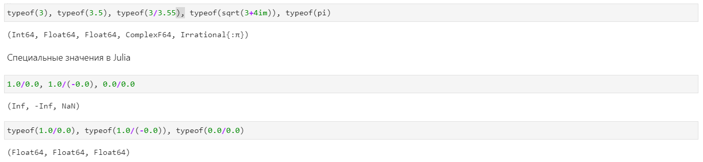{ #fig:1 width=100% }

## Выполнение примеров

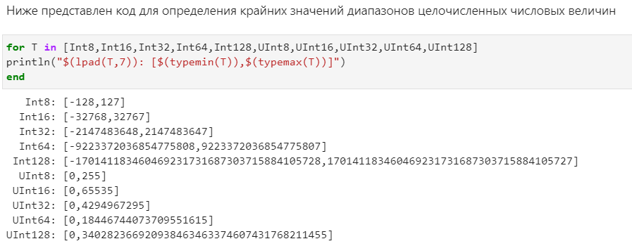{ #fig:2 width=100% }

## Выполнение примеров

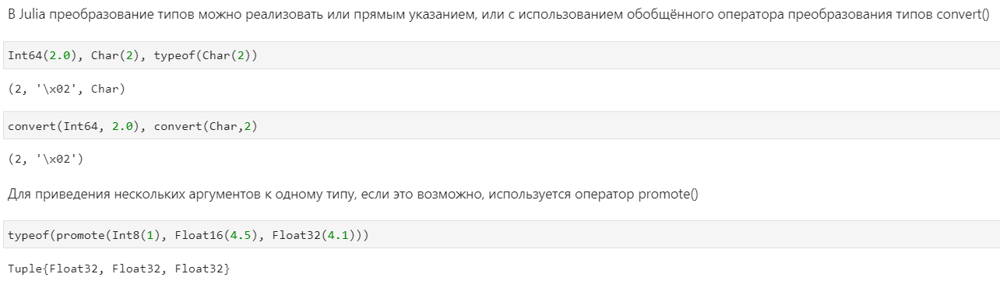{ #fig:3 width=100% }

## Выполнение примеров

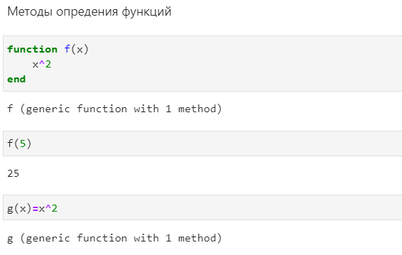{ #fig:4 width=100% }

## Выполнение примеров

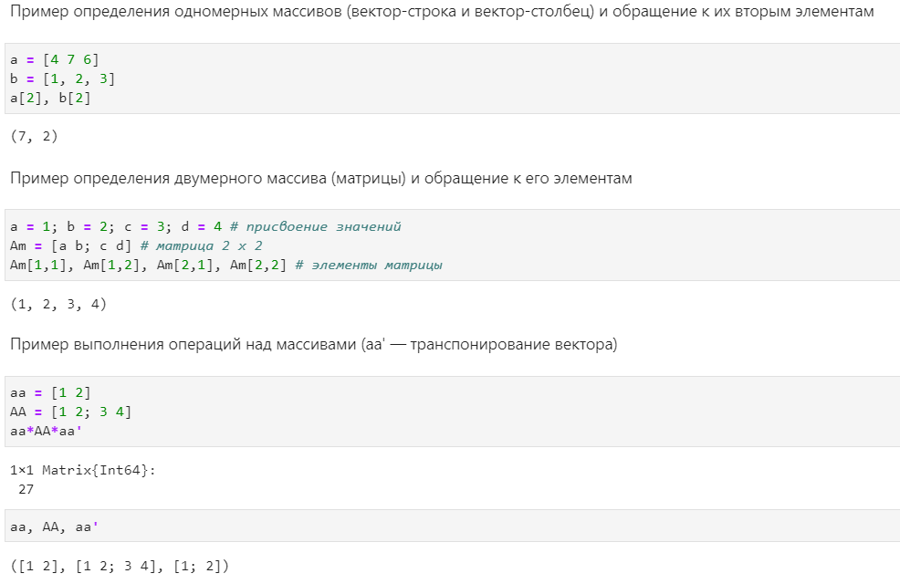{ #fig:5 width=100% }

## Основные функции Julia для чтения / записи / вывода информации на экран

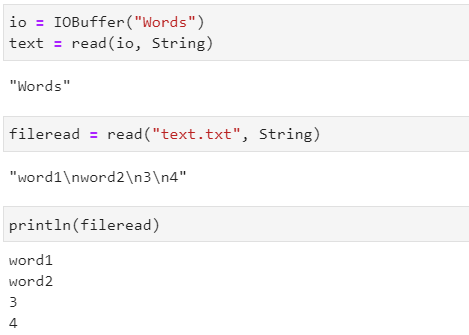{ #fig:6 width=70% }

## Основные функции Julia для чтения / записи / вывода информации на экран

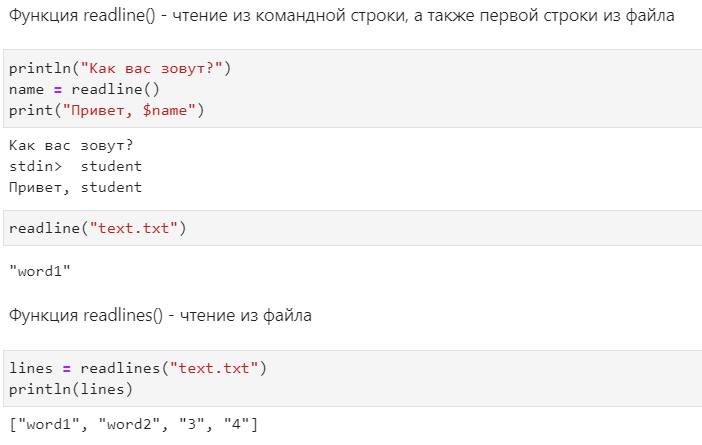{ #fig:7 width=70% }

## Основные функции Julia для чтения / записи / вывода информации на экран

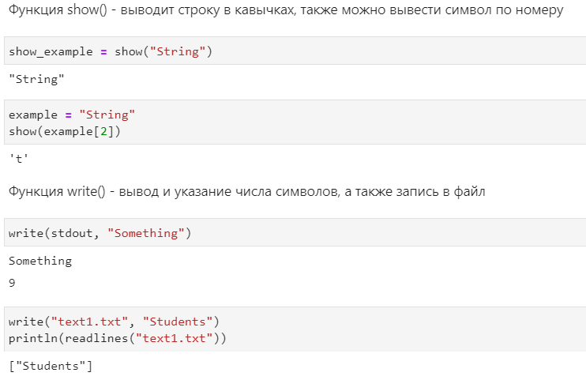{ #fig:8 width=70% }

## Основные функции Julia для чтения / записи / вывода информации на экран

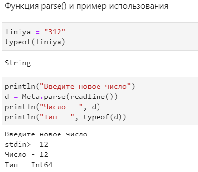{ #fig:9 width=70% }

## Синтаксис для базовых математических операций

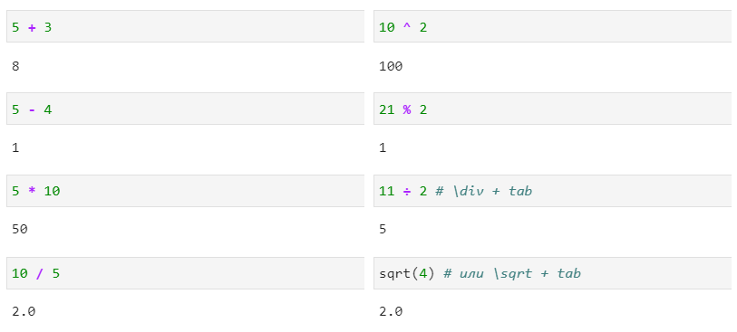{ #fig:10 width=100% }

## Синтаксис для базовых математических операций

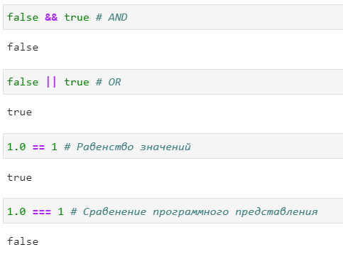{ #fig:11 width=70% }

## Инструменты для работы с матрицами

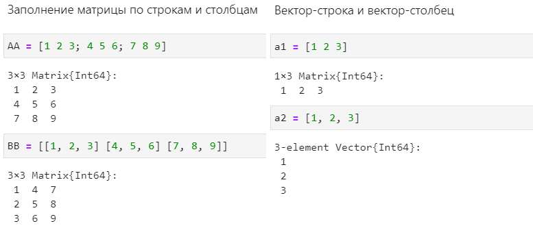{ #fig:12 width=100% }

## Инструменты для работы с матрицами

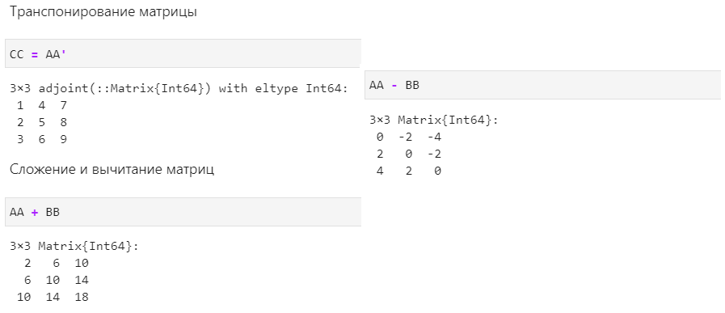{ #fig:13 width=100% }

## Инструменты для работы с матрицами

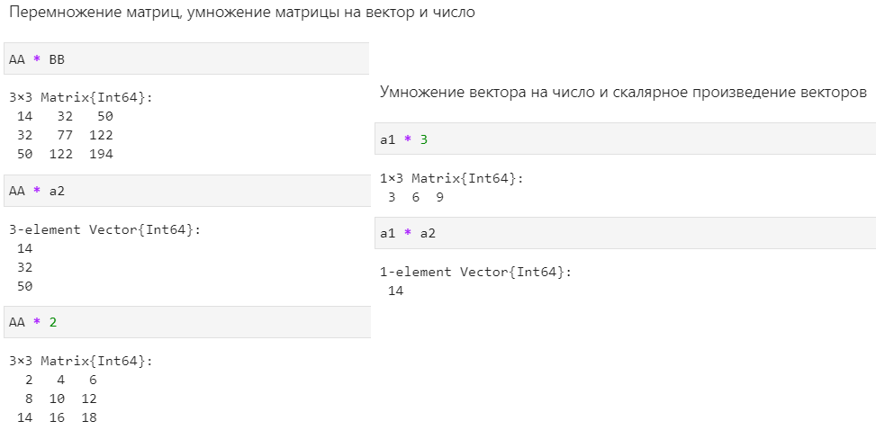{ #fig:14 width=100% }

## Выводы

Во время выполнения лабораторной работы я подготовила инструментарий для работы и ознакомилась с языком Julia для дальнейшей работы.
