---
# Front matter
lang: ru-RU
title: "Лабораторная работа #1. Julia. Установка и настройка. Основные принципы."
author: "Хохлачева Яна, учебная группа: НКНбд-01-18"

# Formatting
toc-title: "Содержание"
toc: true # Table of contents
toc_depth: 2
lof: true # List of figures
fontsize: 12pt
linestretch: 1.5
papersize: a4paper
documentclass: scrreprt
polyglossia-lang: russian
polyglossia-otherlangs: english
mainfont: Times New Roman
romanfont: Times New Roman
sansfont: Times New Roman
monofont: Times New Roman
mainfontoptions: Ligatures=TeX
romanfontoptions: Ligatures=TeX
sansfontoptions: Ligatures=TeX,Scale=MatchLowercase
monofontoptions: Scale=MatchLowercase
indent: true
pdf-engine: lualatex
header-includes:
  - \linepenalty=10 # the penalty added to the badness of each line within a paragraph (no associated penalty node) Increasing the value makes tex try to have fewer lines in the paragraph.
  - \interlinepenalty=0 # value of the penalty (node) added after each line of a paragraph.
  - \hyphenpenalty=50 # the penalty for line breaking at an automatically inserted hyphen
  - \exhyphenpenalty=50 # the penalty for line breaking at an explicit hyphen
  - \binoppenalty=700 # the penalty for breaking a line at a binary operator
  - \relpenalty=500 # the penalty for breaking a line at a relation
  - \clubpenalty=150 # extra penalty for breaking after first line of a paragraph
  - \widowpenalty=150 # extra penalty for breaking before last line of a paragraph
  - \displaywidowpenalty=50 # extra penalty for breaking before last line before a display math
  - \brokenpenalty=100 # extra penalty for page breaking after a hyphenated line
  - \predisplaypenalty=10000 # penalty for breaking before a display
  - \postdisplaypenalty=0 # penalty for breaking after a display
  - \floatingpenalty = 20000 # penalty for splitting an insertion (can only be split footnote in standard LaTeX)
  - \raggedbottom # or \flushbottom
  - \usepackage{float} # keep figures where there are in the text
  - \floatplacement{figure}{H} # keep figures where there are in the text
---

# Цель работы

Основная цель работы — подготовить рабочее пространство и инструментарий для работы с языком программирования Julia, на простейших примерах познакомиться с основами синтаксиса Julia.

# Выполнение работы

## Синтаксис языка Julia на примерах

Используем функцию typeof() для определения типа числовой величины.
 
В Julia введены специальные значения Inf, -Inf, NaN, обозначающие бесконечность и отсутствие какого-либо значения. Такие значения могут получаться в результате операций типа деления на ноль, а также могут быть допустимой частью выражений, поскольку в языке имеют тип вещественного числа.

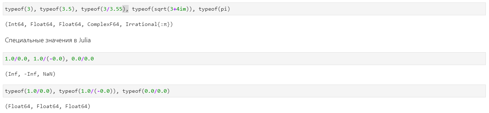{ #fig:1 width=100% }

Код для определения крайних значений диапазонов целочисленных числовых величин

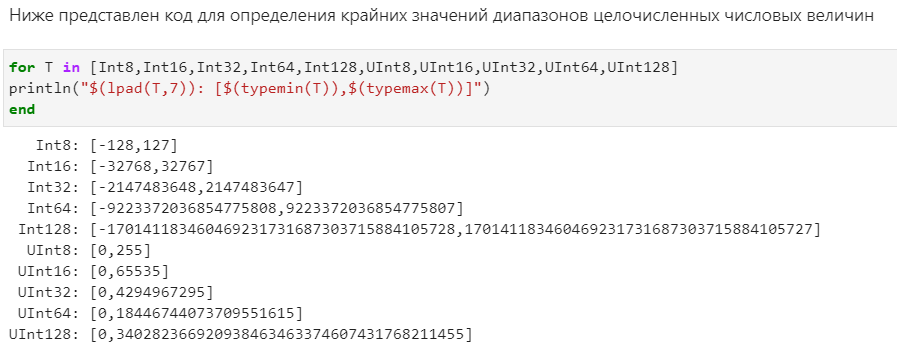{ #fig:2 width=100% }
 
Преобразование типов реализуется или прямым указанием, или с использованием обобщённого оператора convert()

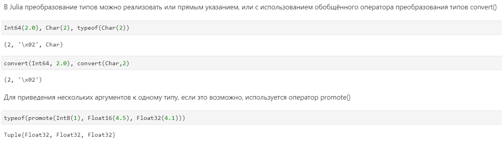{ #fig:3 width=100% }

В Julia есть несколько методов опредения функций

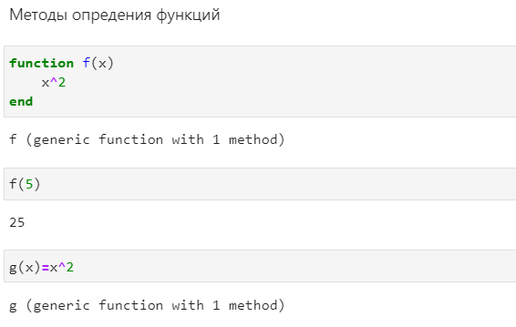{ #fig:4 width=100% }

Синтаксис определения одномерных и двумерных массивов в Julia и обращение к их элементам

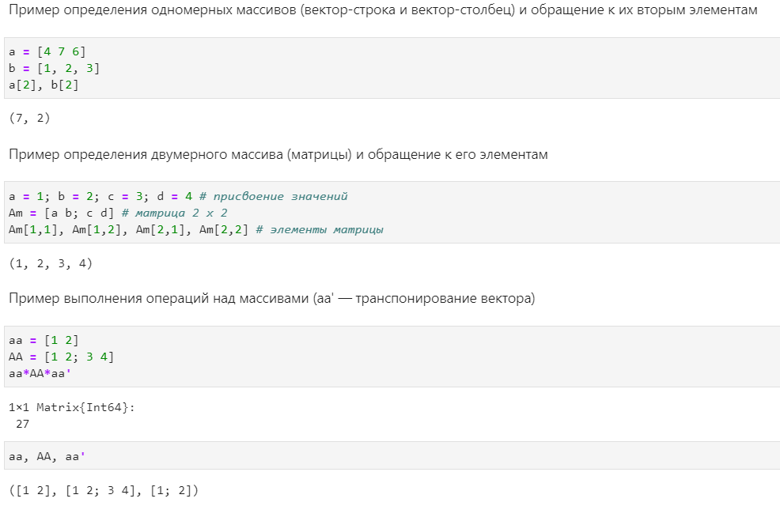{ #fig:5 width=100% }

## Примеры и описание основных функций Julia

Функция read() выполняет чтение из буфера памяти и чтение из файла
 
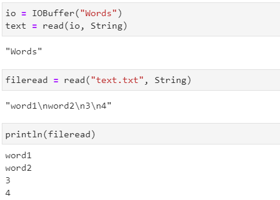{ #fig:6 width=100% }
 
Функция readline() выполняет чтение из командной строки, а также первой строки из файла, функция readlines() выполняет чтение из файла
 
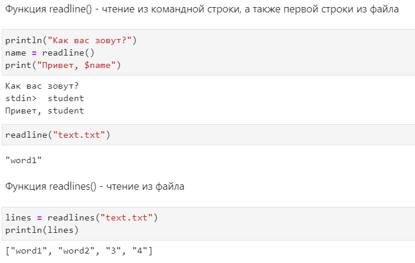{ #fig:7 width=100% }
  
Функция show() выводит строку в кавычках, также можно использовать для определения символа по номеру, функция write() используется для вывода и указывает количество символов
 
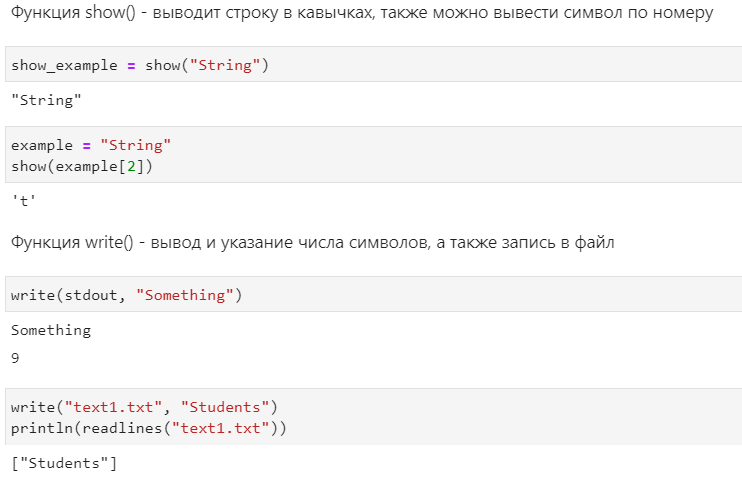{ #fig:8 width=100% }

Функция parse() используется для изменения типа данных. Может быть использована для перевода вводимых данных, так как ввод всегда осуществляется в формате String.
   
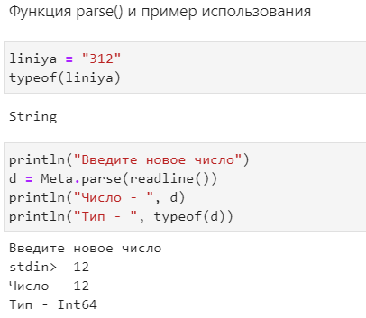{ #fig:9 width=100% }
	
## Синтаксис Julia для базовых математических операций 
	
- Примеры операций сложения, вычитания, умножения, деления, возведения в степень, нахождения остатка от числа, целочисленного деления, получения корня от числа.

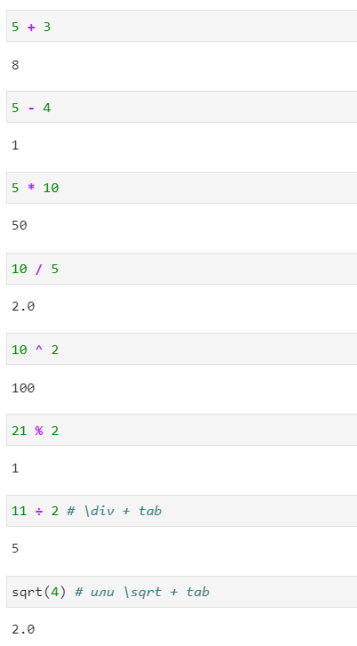{ #fig:10 width=100% }

В Julia представлены следующие операторы сравнения:

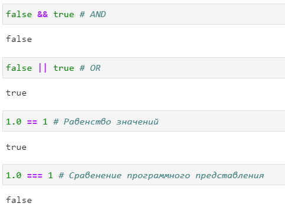{ #fig:11 width=100% }

## Операции над матрицами

Матрицы и вектора в Julia заполняются следующими методами: 
 
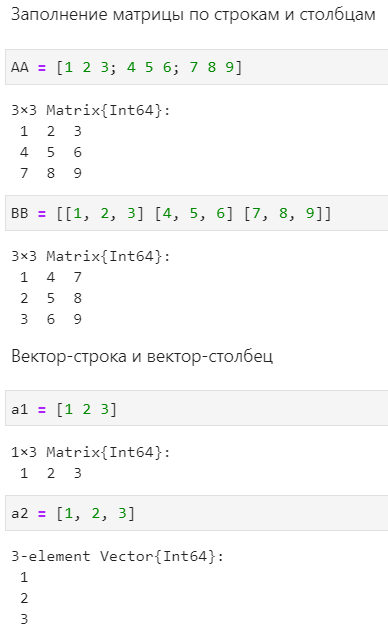{ #fig:12 width=100% }

Транспонирование матрицы, сложение и вычитание матриц: 
 
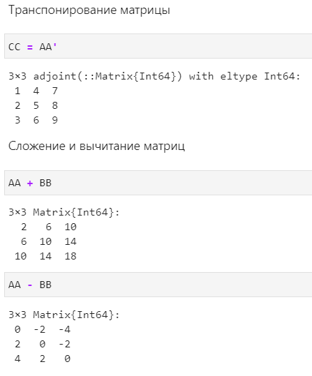{ #fig:13 width=100% }

Умножение матриц, и операции с векторами

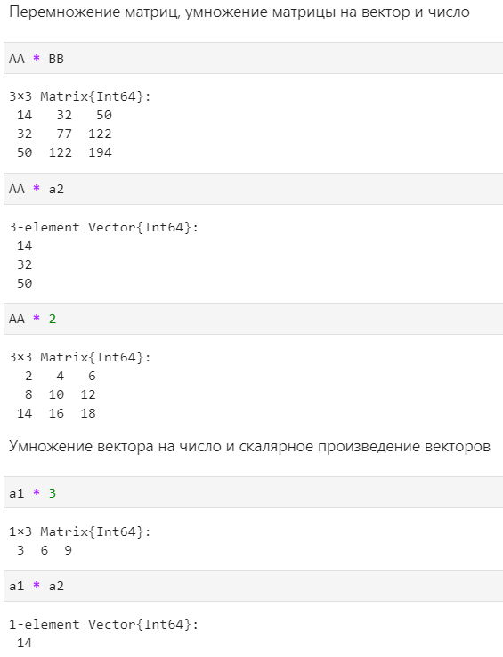{ #fig:14 width=100% }

# Выводы 
 
  - Во время выполнения лабораторной работы я подготовила инструментарий для работы и ознакомилась с языком Julia для дальнейшей работы.
