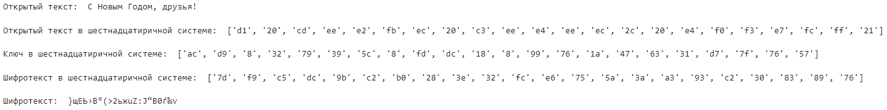
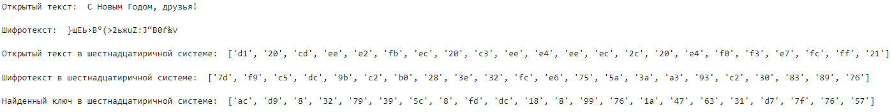
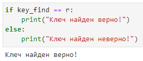
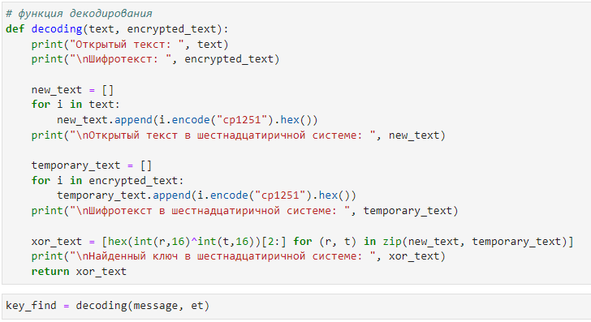
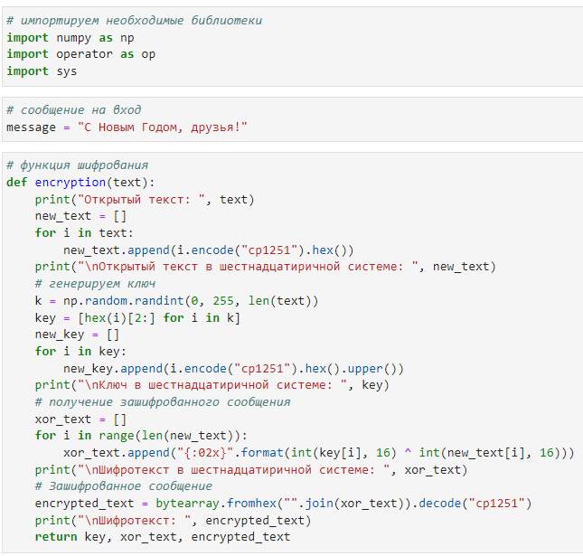

---
## Front matter
lang: ru-RU
title: Лабораторная работа #7
author:	Хохлачева Яна

## Formatting
toc: false
slide_level: 2
theme: metropolis
header-includes: 
 - \metroset{progressbar=frametitle,sectionpage=progressbar,numbering=fraction}
 - '\makeatletter'
 - '\beamer@ignorenonframefalse'
 - '\makeatother'
aspectratio: 43
section-titles: true
---

# Элементы криптографии. Однократное гаммирование

## Цель работы

 - Освоить на практике применение режима однократного гаммирования.
 
## Функция кодирования

\centering
{ width=65% }

## Результат выполнения функции

\centering
{ width=100% }

## Функция декодирования

\centering
{ width=100% }

## Результат выполнения функции

\centering
{ width=100% }

## Проверка

\centering
{ width=70% }

# Вывод 
 
 - Освоила на практике применение режима однократного гаммирования.