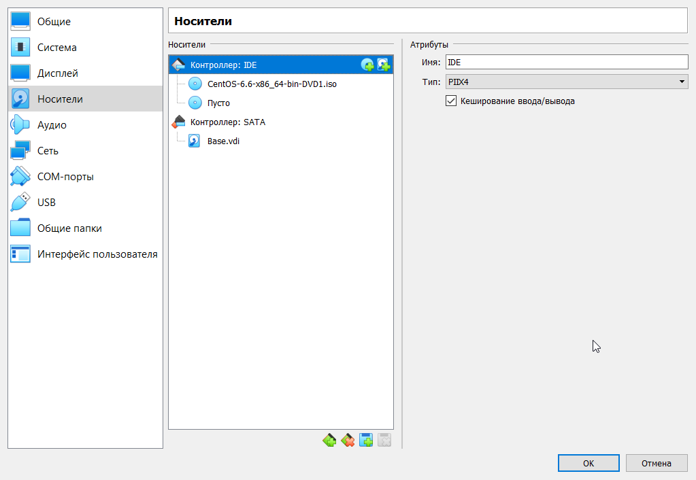

---
## Front matter
lang: ru-RU
title: Лабораторная работа #1
author:	Хохлачева Яна, НКНбд-01-18

## Formatting
toc: false
slide_level: 2
theme: metropolis
header-includes: 
 - \metroset{progressbar=frametitle,sectionpage=progressbar,numbering=fraction}
 - '\makeatletter'
 - '\beamer@ignorenonframefalse'
 - '\makeatother'
aspectratio: 43
section-titles: true
---

# Установка и конфигурация операционной системы на виртуальную машину

## Цель работы

 - Приобретение практических навыков установки операционной системы на виртуальную машину, настройки минимально необходимых для дальнейшей работы сервисов.

## Создание виртуальной машины

{ width=70% }

## Создание виртуальной машины

{ width=70% }

## Установка CentOS

\centering

{ width=40% }
{ width=40% }
{ width=40% }
{ width=40% }

## Установка CentOS

\centering

{ width=40% }
{ width=40% }
{ width=40% }
{ width=40% }

## Запуск системы

\centering

{ width=40% }
{ width=40% }
{ width=40% }
{ width=40% }

## Запуск системы

\centering

{ width=40% }
{ width=40% }

## Создание второй виртуальной машины

{ width=40% }

# Вывод 
 
 - Во время выполнения работы приобрела практические навыки установки операционной системы на виртуальную машину и настроила ее для дальнейшей работы.

