---
# Front matter
lang: ru-RU
title: "Лабораторная работа #1."
subtitle: "Установка и конфигурация операционной системы на виртуальную машину"
author: "Хохлачева Яна, учебная группа: НКНбд-01-18"

# Formatting
toc-title: "Содержание"
toc: true # Table of contents
toc_depth: 2
lof: true # List of figures
fontsize: 12pt
linestretch: 1.5
papersize: a4paper
documentclass: scrreprt
polyglossia-lang: russian
polyglossia-otherlangs: english
mainfont: Times New Roman
romanfont: Times New Roman
sansfont: Times New Roman
monofont: Times New Roman
mainfontoptions: Ligatures=TeX
romanfontoptions: Ligatures=TeX
sansfontoptions: Ligatures=TeX,Scale=MatchLowercase
monofontoptions: Scale=MatchLowercase
indent: true
pdf-engine: lualatex
header-includes:
  - \linepenalty=10 # the penalty added to the badness of each line within a paragraph (no associated penalty node) Increasing the value makes tex try to have fewer lines in the paragraph.
  - \interlinepenalty=0 # value of the penalty (node) added after each line of a paragraph.
  - \hyphenpenalty=50 # the penalty for line breaking at an automatically inserted hyphen
  - \exhyphenpenalty=50 # the penalty for line breaking at an explicit hyphen
  - \binoppenalty=700 # the penalty for breaking a line at a binary operator
  - \relpenalty=500 # the penalty for breaking a line at a relation
  - \clubpenalty=150 # extra penalty for breaking after first line of a paragraph
  - \widowpenalty=150 # extra penalty for breaking before last line of a paragraph
  - \displaywidowpenalty=50 # extra penalty for breaking before last line before a display math
  - \brokenpenalty=100 # extra penalty for page breaking after a hyphenated line
  - \predisplaypenalty=10000 # penalty for breaking before a display
  - \postdisplaypenalty=0 # penalty for breaking after a display
  - \floatingpenalty = 20000 # penalty for splitting an insertion (can only be split footnote in standard LaTeX)
  - \raggedbottom # or \flushbottom
  - \usepackage{float} # keep figures where there are in the text
  - \floatplacement{figure}{H} # keep figures where there are in the text
---

# Цель работы

 - Приобретение практических навыков установки операционной системы на виртуальную машину, настройки минимально необходимых для дальнейшей работы сервисов.

# Выполнение лабораторной работы

 - Запустила Virtual Box.

 - Создала машину Base с типом Linux RedHat 

 - Задала оперативную память размером 1024 МБ и динамический жесткий диск на 40 ГБ.

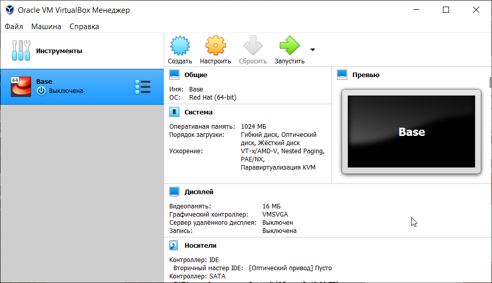{ #fig:001 width=70% }

 - В менеджере носителей подключила образ CentOs 6. 

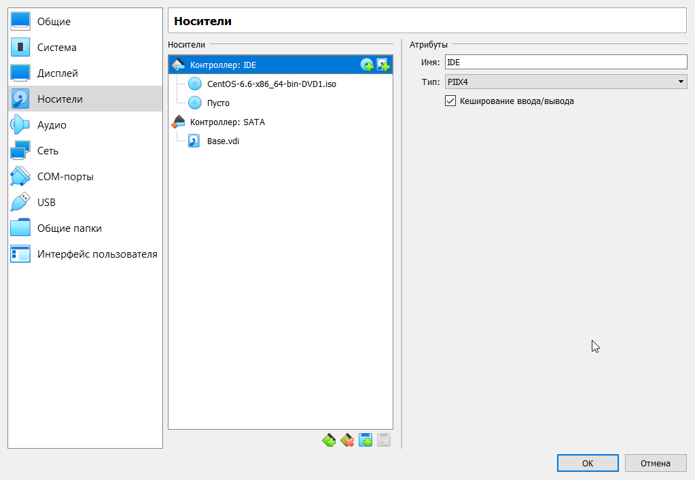{ #fig:002 width=70% }

 - После перезапуска системы начала устанавливать операционную систему

 - В качестве языка установки выбрала Русский, язык раскладки - Английский, стандартные накопители, имя компьютера, время, а также пароль для root. 

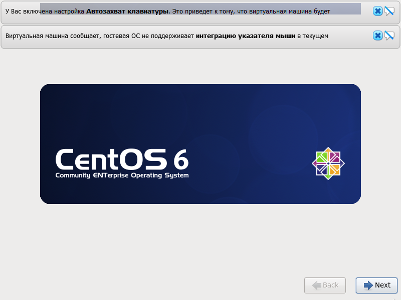{ #fig:003 width=70% }

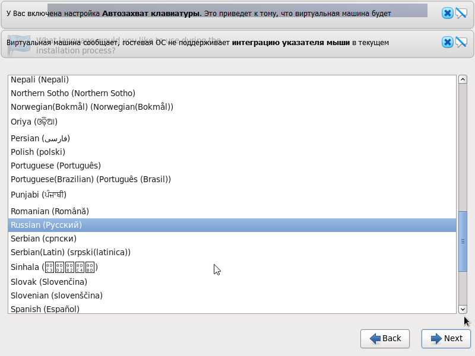{ #fig:004 width=70% }

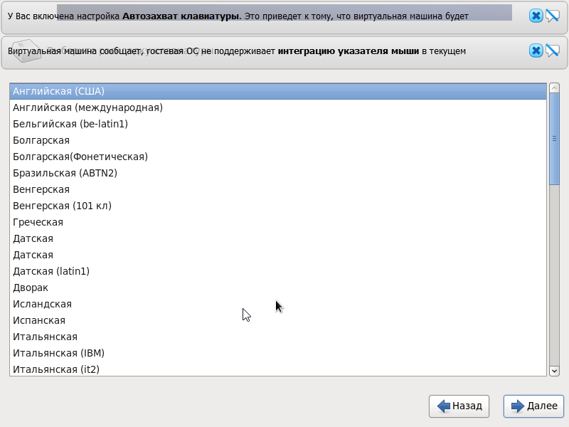{ #fig:005 width=70% }

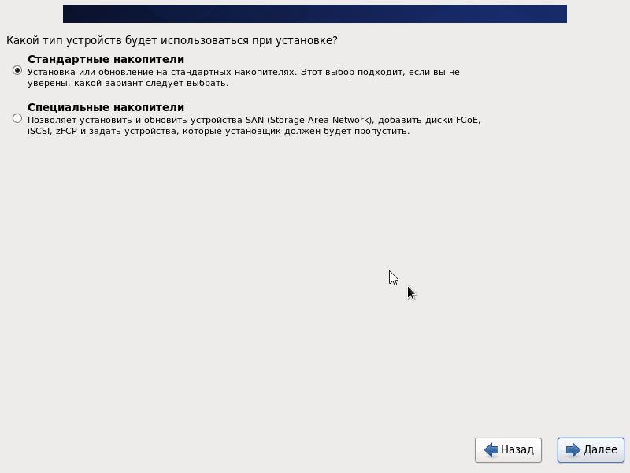{ #fig:006 width=70% }

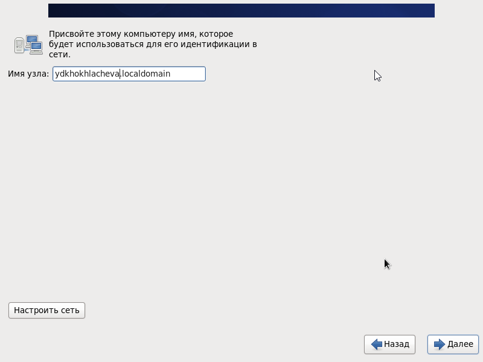{ #fig:007 width=70% }

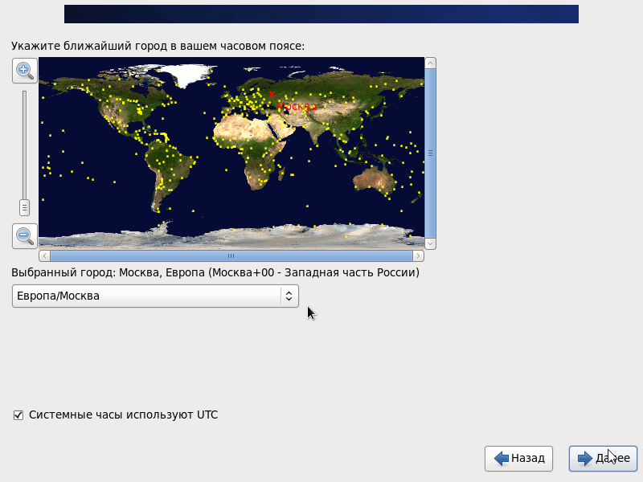{ #fig:008 width=70% }

{ #fig:009 width=70% }

 - После выбора типа установки началась установка ОС.
 
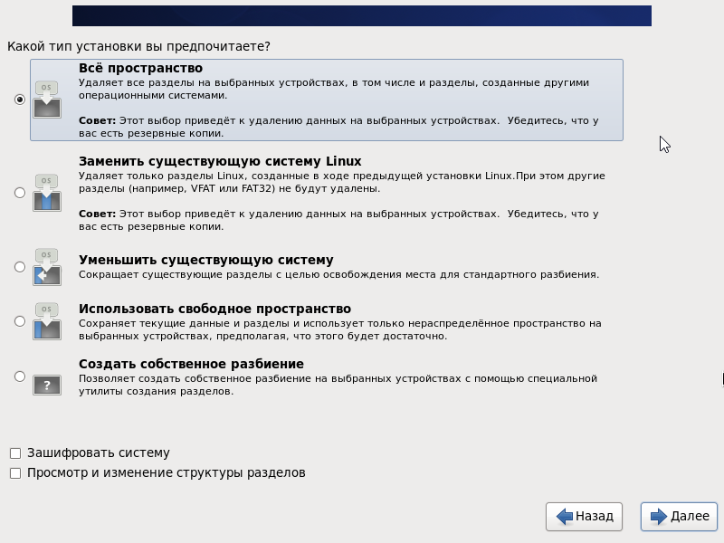{ #fig:010 width=70% }

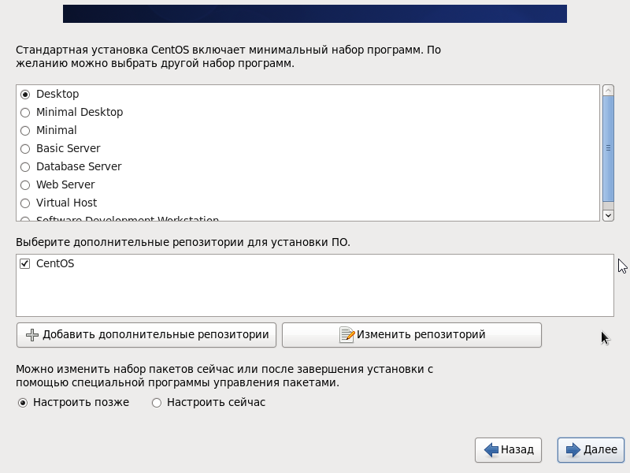{ #fig:011 width=70% }

 - Первый вход в систему. 

 - После первого входа в систему выполнила необходимые шаги, для первого запуска системы. 

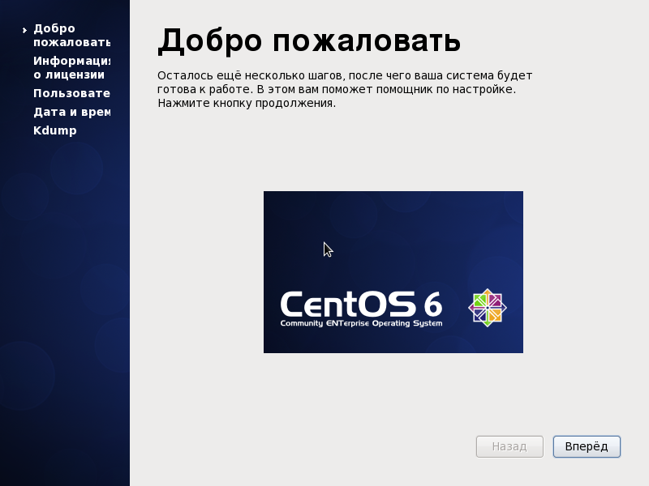{ #fig:012 width=70% }

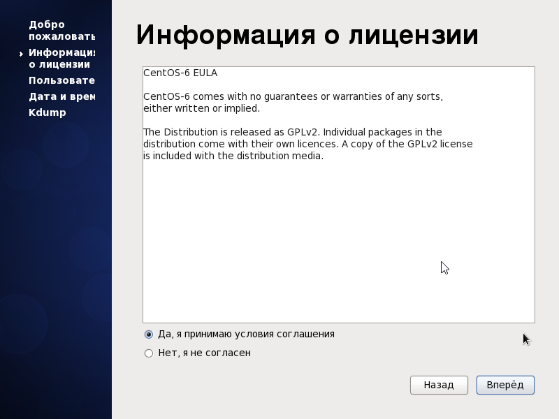{ #fig:013 width=70% }

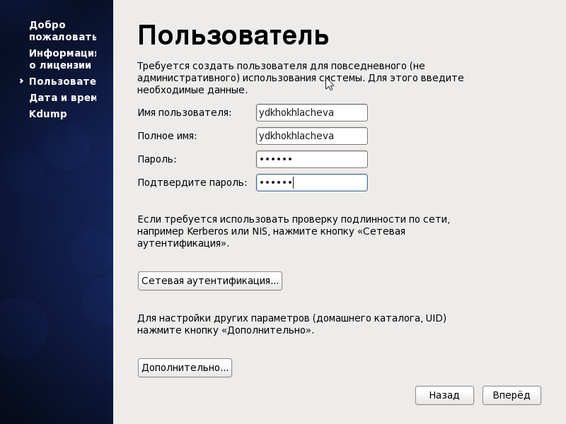{ #fig:014 width=70% }

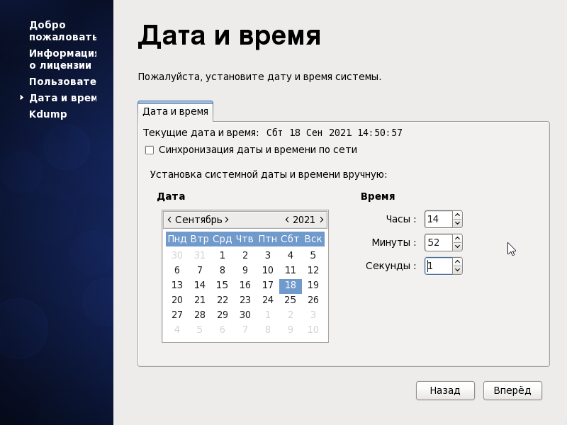{ #fig:015 width=70% }

 - После входа в систему установила Midnight Commander при помощи команды yum install mc, перейдя в режим администратора командой su

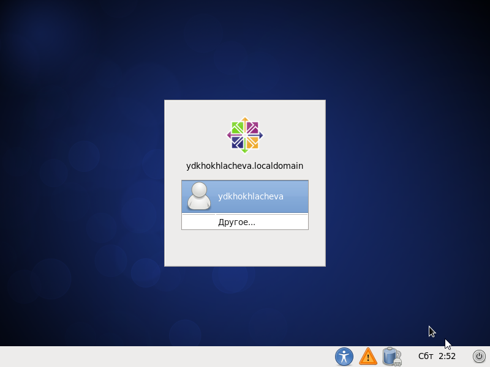{ #fig:016 width=70% }

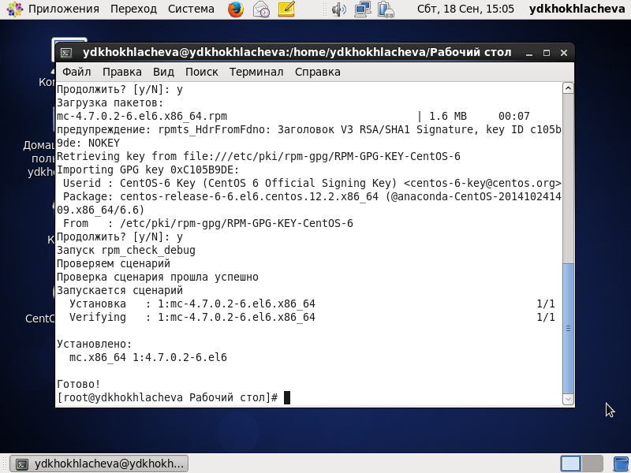{ #fig:017 width=70% }

 - После завершения работы с ОС через Virtual Box manager изменила виртуальный диск на множественные подключения и создала вторую машину Host2
 
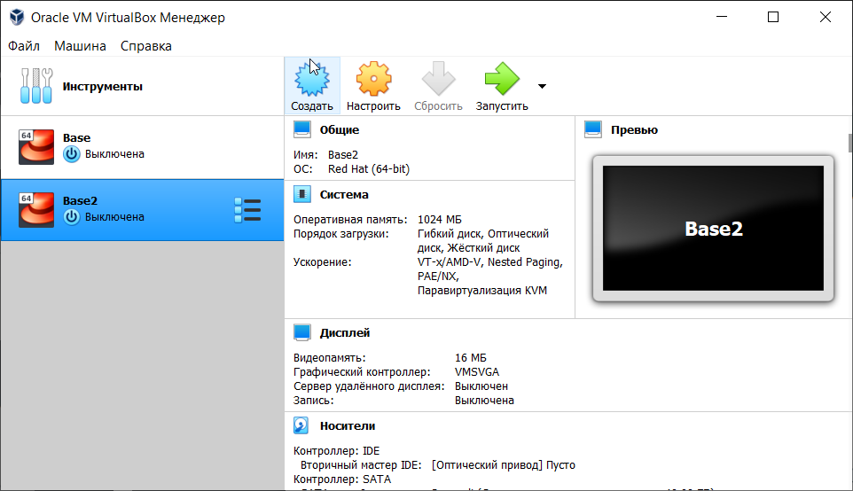{ #fig:018 width=70% }

# Вывод 
 
  - Во время выполнения работы приобрела практические навыки установки операционной системы на виртуальную машину и настроила ее для дальнейшей работы.
