---
## Front matter
lang: ru-RU
title: Лабораторная работа 2
author:	Хохлачева Яна

## Formatting
toc: false
slide_level: 2
theme: metropolis
header-includes: 
 - \metroset{progressbar=frametitle,sectionpage=progressbar,numbering=fraction}
 - '\makeatletter'
 - '\beamer@ignorenonframefalse'
 - '\makeatother'
aspectratio: 43
section-titles: true
---

# Дискреционное разграничение прав в Linux. Основные атрибуты

## Цель работы

 - Получение практических навыков работы в консоли с атрибутами файлов, закрепление теоретических основ дискреционного разграничения доступа в современных системах с открытым кодом на базе ОС Linux.

## Создание нового пользователя и выполнение входа в систему

\centering

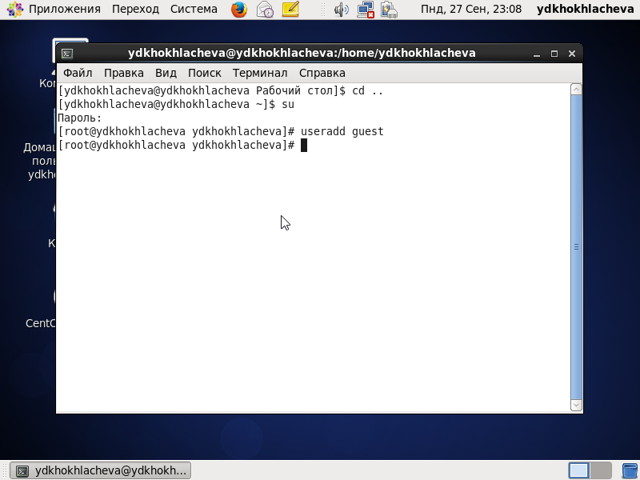{ width=40% }
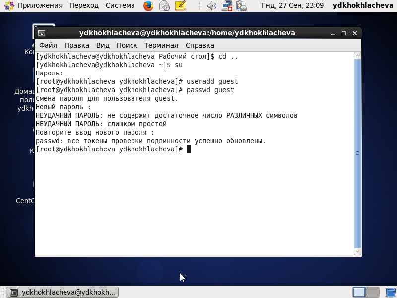{ width=40% }
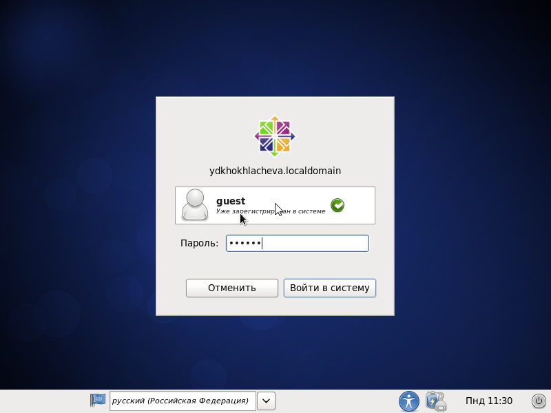{ width=40% }
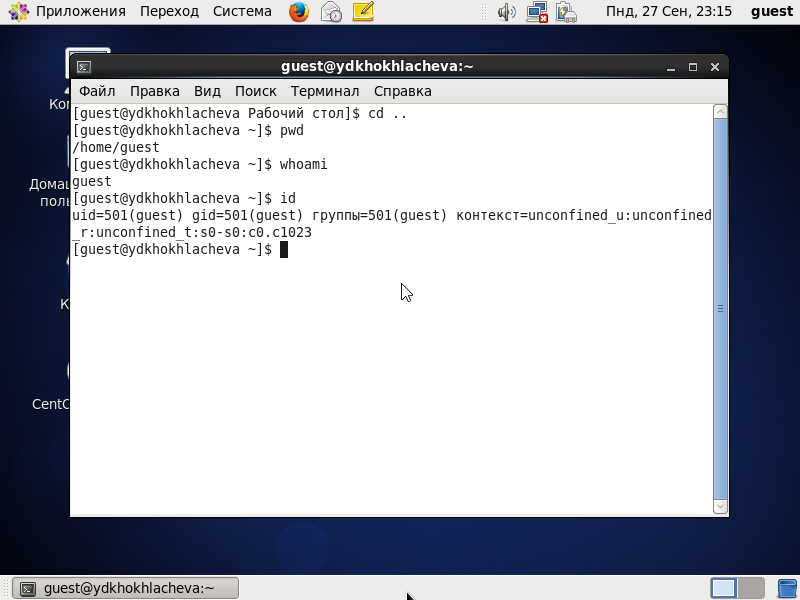{ width=40% }

## Выполнение пунктов 6-9

\centering

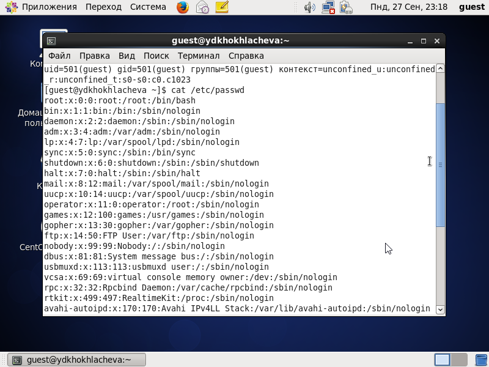{ width=50% }
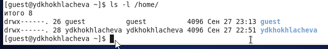{ width=50% }
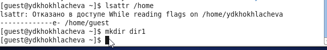{ width=50% }
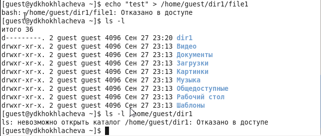{ width=50% }

## Выполнение пунктов 10-13

\centering

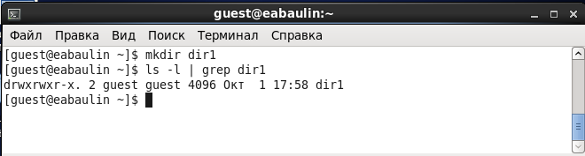{ width=50% }
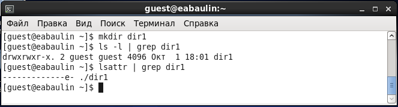{ width=50% }
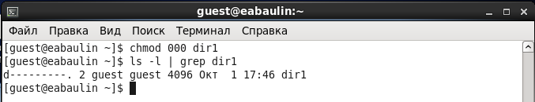{ width=50% }
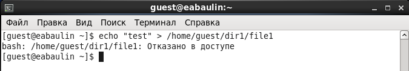{ width=50% }

# Вывод 
 
Во время выполнения работы получила практические навыки работы в консоли с атрибутами файлов, и закрепила теоретические основы дискреционного разграничения доступа в современных системах с открытым кодом на базе ОС Linux.
