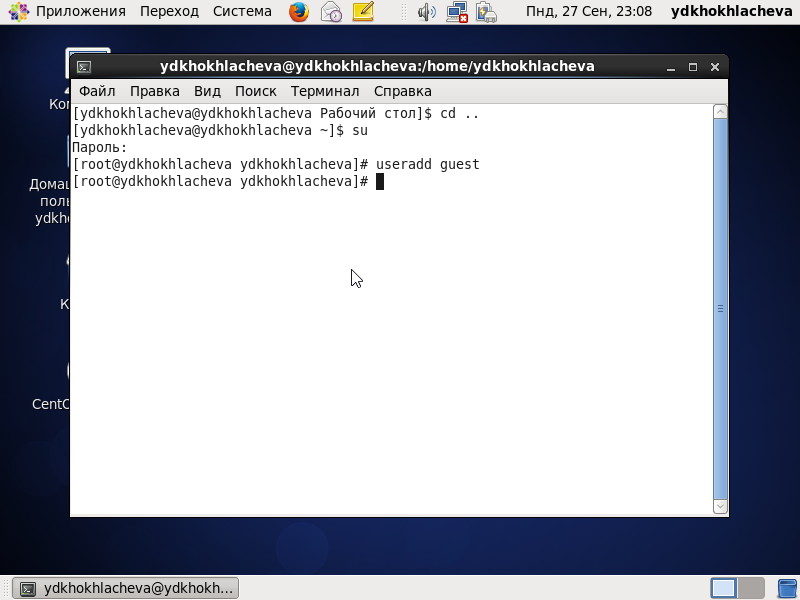
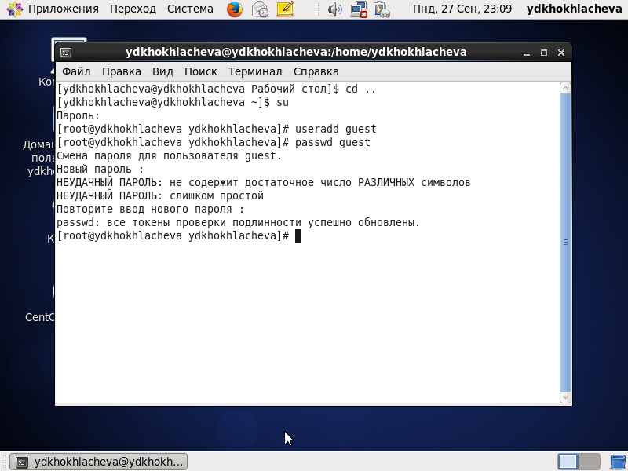
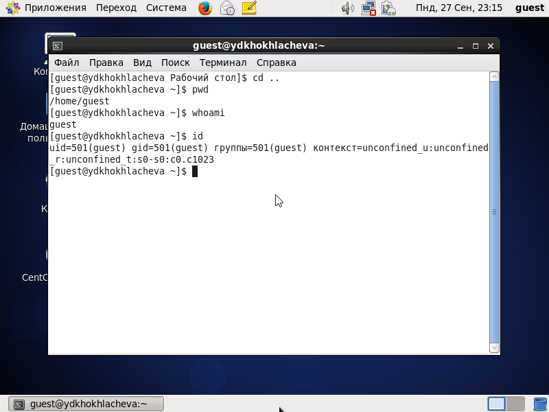
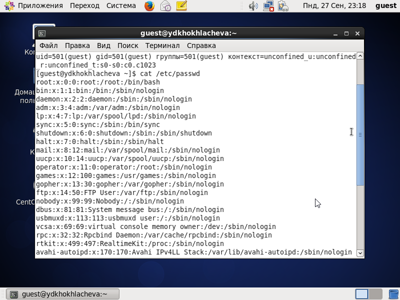
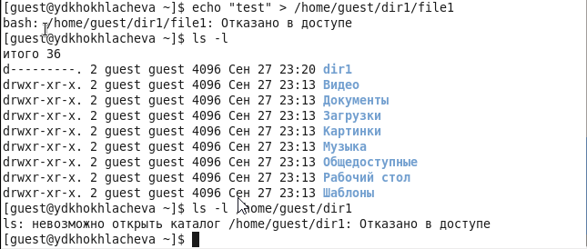
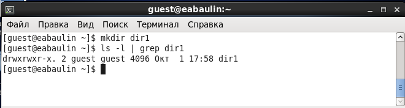

---
# Front matter
lang: ru-RU
title: "Информационная безопасность. Лабораторная работа #2."
subtitle: "Дискреционное разграничение прав в Linux. Основные атрибуты"
author: "Хохлачева Яна"

# Formatting
toc-title: "Содержание"
toc: true # Table of contents
toc_depth: 2
lof: true # List of figures
lot: true # List of tables
fontsize: 12pt
linestretch: 1.5
papersize: a4paper
documentclass: scrreprt
polyglossia-lang: russian
polyglossia-otherlangs: english
mainfont: Times New Roman
romanfont: Times New Roman
sansfont: Times New Roman
monofont: Times New Roman
mainfontoptions: Ligatures=TeX
romanfontoptions: Ligatures=TeX
sansfontoptions: Ligatures=TeX,Scale=MatchLowercase
monofontoptions: Scale=MatchLowercase
indent: true
pdf-engine: lualatex
header-includes:
  - \linepenalty=10 # the penalty added to the badness of each line within a paragraph (no associated penalty node) Increasing the value makes tex try to have fewer lines in the paragraph.
  - \interlinepenalty=0 # value of the penalty (node) added after each line of a paragraph.
  - \hyphenpenalty=50 # the penalty for line breaking at an automatically inserted hyphen
  - \exhyphenpenalty=50 # the penalty for line breaking at an explicit hyphen
  - \binoppenalty=700 # the penalty for breaking a line at a binary operator
  - \relpenalty=500 # the penalty for breaking a line at a relation
  - \clubpenalty=150 # extra penalty for breaking after first line of a paragraph
  - \widowpenalty=150 # extra penalty for breaking before last line of a paragraph
  - \displaywidowpenalty=50 # extra penalty for breaking before last line before a display math
  - \brokenpenalty=100 # extra penalty for page breaking after a hyphenated line
  - \predisplaypenalty=10000 # penalty for breaking before a display
  - \postdisplaypenalty=0 # penalty for breaking after a display
  - \floatingpenalty = 20000 # penalty for splitting an insertion (can only be split footnote in standard LaTeX)
  - \raggedbottom # or \flushbottom
  - \usepackage{float} # keep figures where there are in the text
  - \floatplacement{figure}{H} # keep figures where there are in the text
  - \usepackage{pdflscape}
  - \newcommand{\blandscape}{\begin{landscape}}
  - \newcommand{\elandscape}{\end{landscape}}
---

# Цель работы

Получение практических навыков работы в консоли с атрибутами файлов, закрепление теоретических основ дискреционного разграничения доступа в современных системах с открытым кодом на базе ОС Linux.

# Выполнение работы

1. В установленной при выполнении предыдущей лабораторной работы операционной системе создала учётную запись пользователя guest (использую учётную запись администратора) при помощи команды ``` useradd guest ```

{ #fig:01 width=100% }

2. Задала пароль для пользователя guest (используя учётную запись администратора) командой ``` passwd guest```

{ #fig:02 width=100% }

3. Вошла в систему от имени пользователя guest

{ #fig:03 width=100% }

4. Определила директорию, в которой нахожусь, командой ```pwd```. Нахожусь в домашней директории.

5. Уточнила имя пользователя командой ``` whoami``` 

{ #fig:04 width=100% }

6. Уточнила имя пользователя, его группу, а также группы, куда входит пользователь, командой ```id```. uid = 501, gid=501. По сравнению с командой ```groups``` увеличено количество информации о пользователе.

{ #fig:05 width=100% }

7. Информация об имени пользователя совпадает с данными, выводимыми в приглашении командной строки.

8. Просмотрела файл /etc/passwd командой ```cat /etc/passwd```. Данные uid и gid совпадают с предыдущими пунктами. 

{ #fig:06 width=100% }

9. Определила существующие в системе директории командой ```ls -l /home/```. 

{ #fig:07 width=100% }

10. Проверила, какие расширенные атрибуты установлены на поддиректориях, находящихся в директории /home, командой: ```lsattr /home```. Расширеные атрибуты директории увидеть не удалось. 

{ #fig:08 width=100% }

11. Создала в домашней директории поддиректорию dir1 командой ```mkdir dir1```. Определила командами ```ls -l``` и ```lsattr```, какие права доступа и расширенные атрибуты были выставлены на директорию dir1. У всех есть права на чтение и выполнение, но только у создателя и группы создателя
есть права на запись. Расширенные атрибуты просмотреть не удалось.

{ #fig:09 width=100% }

12. Сняла с директории dir1 все атрибуты командой ```chmod 000 dir1``` и проверила с её помощью правильность выполнения команды ```ls -l```

{ #fig:10 width=100% }

13. Попыталась создать в директории dir1 файл file1 командой ```echo "test" > /home/guest/dir1/file1``` 
```ls -l /home/guest/dir1```

{ #fig:11 width=100% }

# Таблица 2. "Минимальные права для совершения операций"

 |        Операция        	| Минимальные права на директорию 	| Минимальные права на файл 	|
 |:----------------------:	|:-------------------------------:	|:-------------------------:	|
 |     Создание файла     	|        d-wx------  (300)        	|      ---------  (000)     	|
 |     Удаление файла     	|        d-wx------  (300)        	|      ---------  (000)     	|
 |      Чтение файла      	|        d--x------  (100)        	|      r--------  (400)     	|
 |      Запись в файл     	|        d--x------  (100)        	|      -w-------  (200)     	|
 |  Переименование файла  	|        d-wx------  (300)        	|      ---------  (000)      	|
 | Создание поддиректории 	|        d-wx------  (300)        	|      ---------  (000)      	|
 | Удаление поддиректории 	|        d-wx------  (300)        	|      ---------  (000)      	|

# Таблица 1

\blandscape

 | Права директории 	|   Права файла   	| Создание файла 	| Удаление файла 	| Запись в файл 	| Чтение файла 	| Смена   директории 	| Просмотр файлов   в директории 	| Переименование   файла 	| Смена атрибутов  файла 	|
 |:----------------:	|:---------------:	|:--------------:	|:--------------:	|:-------------:	|:------------:	|:------------------:	|:------------------------------:	|:----------------------:	|:----------------------:	|
 | d--------- (000) 	|        0        	|        -       	|        -       	|       -       	|       -      	|          -         	|                -               	|            -           	|            -           	|
 | d--x------ (100) 	|        0        	|        -       	|        -       	|       -       	|       -      	|          +         	|                -               	|            -           	|            +           	|
 | d-w------- (200) 	|        0        	|        -       	|        -       	|       -       	|       -      	|          -         	|                -               	|            -           	|            -           	|
 | d-wx------ (300) 	|        0        	|        +       	|        +       	|       -       	|       -      	|          +         	|                -               	|            +           	|            +           	|
 | dr-------- (400) 	|        0        	|        -       	|        -       	|       -       	|       -      	|          -         	|                +               	|            -           	|            -           	|
 | dr-x------ (500) 	|        0        	|        -       	|        -       	|       -       	|       -      	|          +         	|                +               	|            -           	|            +           	|
 | drw------- (600) 	|        0        	|        -       	|        -       	|       -       	|       -      	|          -         	|                +               	|            -           	|            -           	|
 | drwx------ (700) 	|        0        	|        +       	|        +       	|       -       	|       -      	|          +         	|                +               	|            +           	|            +           	|
 | d--------- (000) 	| --x------ (100) 	|        -       	|        -       	|       -       	|       -      	|          -         	|                -               	|            -           	|            -           	|
 | d--x------ (100) 	| --x------ (100) 	|        -       	|        -       	|       -       	|       -      	|          +         	|                -               	|            -           	|            +           	|
 | d-w------- (200) 	| --x------ (100) 	|        -       	|        -       	|       -       	|       -      	|          -         	|                -               	|            -           	|            -           	|
 | d-wx------ (300) 	| --x------ (100) 	|        +       	|        +       	|       -       	|       -      	|          +         	|                -               	|            +           	|            +           	|
 | dr-------- (400) 	| --x------ (100) 	|        -       	|        -       	|       -       	|       -      	|          -         	|                +               	|            -           	|            -           	|
 | dr-x------ (500) 	| --x------ (100) 	|        -       	|        -       	|       -       	|       -      	|          +         	|                +               	|            -           	|            +           	|
 | drw------- (600) 	| --x------ (100) 	|        -       	|        -       	|       -       	|       -      	|          -         	|                +               	|            -           	|            -           	|
 | drwx------ (700) 	| --x------ (100) 	|        +       	|        +       	|       -       	|       -      	|          +         	|                +               	|            +           	|            +           	|
 | d--------- (000) 	| -w------- (200) 	|        -       	|        -       	|       -       	|       -      	|          -         	|                -               	|            -           	|            -           	|
 | d--x------ (100) 	| -w------- (200) 	|        -       	|        -       	|       +       	|       -      	|          +         	|                -               	|            -           	|            +           	|
 | d-w------- (200) 	| -w------- (200) 	|        -       	|        -       	|       -       	|       -      	|          -         	|                -               	|            -           	|            -           	|
 | d-wx------ (300) 	| -w------- (200) 	|        +       	|        +       	|       +       	|       -      	|          +         	|                -               	|            +           	|            +           	|
 | dr-------- (400) 	| -w------- (200) 	|        -       	|        -       	|       -       	|       -      	|          -         	|                +               	|            -           	|            -           	|
 | dr-x------ (500) 	| -w------- (200) 	|        -       	|        -       	|       +       	|       -      	|          +         	|                +               	|            -           	|            +           	|
 | drw------- (600) 	| -w------- (200) 	|        -       	|        -       	|       -       	|       -      	|          -         	|                +               	|            -           	|            -           	|
 | drwx------ (700) 	| -w------- (200) 	|        +       	|        +       	|       +       	|       -      	|          +         	|                +               	|            +           	|            +           	|
 | d--------- (000) 	| -wx------ (300) 	|        -       	|        -       	|       -       	|       -      	|          -         	|                -               	|            -           	|            -           	|
 | d--x------ (100) 	| -wx------ (300) 	|        -       	|        -       	|       +       	|       -      	|          +         	|                -               	|            -           	|            +           	|
 | d-w------- (200) 	| -wx------ (300) 	|        -       	|        -       	|       -       	|       -      	|          -         	|                -               	|            -           	|            -           	|
 | d-wx------ (300) 	| -wx------ (300) 	|        +       	|        +       	|       +       	|       -      	|          +         	|                -               	|            +           	|            +           	|
 | dr-------- (400) 	| -wx------ (300) 	|        -       	|        -       	|       -       	|       -      	|          -         	|                +               	|            -           	|            -           	|
 | dr-x------ (500) 	| -wx------ (300) 	|        -       	|        -       	|       +       	|       -      	|          +         	|                +               	|            -           	|            +           	|
 | drw------- (600) 	| -wx------ (300) 	|        -       	|        -       	|       -       	|       -      	|          -         	|                +               	|            -           	|            -           	|
 | drwx------ (700) 	| -wx------ (300) 	|        +       	|        +       	|       +       	|       -      	|          +         	|                +               	|            +           	|            +           	|
 | d--------- (000) 	| r-------- (400) 	|        -       	|        -       	|       -       	|       -      	|          -         	|                -               	|            -           	|            -           	|
 | d--x------ (100) 	| r-------- (400) 	|        -       	|        -       	|       -       	|       +      	|          +         	|                -               	|            -           	|            +           	|
 | d-w------- (200) 	| r-------- (400) 	|        -       	|        -       	|       -       	|       -      	|          -         	|                -               	|            -           	|            -           	|
 | d-wx------ (300) 	| r-------- (400) 	|        +       	|        +       	|       -       	|       +      	|          +         	|                -               	|            +           	|            +           	|
 | dr-------- (400) 	| r-------- (400) 	|        -       	|        -       	|       -       	|       -      	|          -         	|                +               	|            -           	|            -           	|
 | dr-x------ (500) 	| r-------- (400) 	|        -       	|        -       	|       -       	|       +      	|          +         	|                +               	|            -           	|            +           	|
 | drw------- (600) 	| r-------- (400) 	|        -       	|        -       	|       -       	|       -      	|          -         	|                +               	|            -           	|            -           	|
 | drwx------ (700) 	| r-------- (400) 	|        +       	|        +       	|       -       	|       +      	|          +         	|                +               	|            +           	|            +           	|
 | d--------- (000) 	| r-x------ (500) 	|        -       	|        -       	|       -       	|       -      	|          -         	|                -               	|            -           	|            -           	|
 | d--x------ (100) 	| r-x------ (500) 	|        -       	|        -       	|       -       	|       +      	|          +         	|                -               	|            -           	|            +           	|
 | d-w------- (200) 	| r-x------ (500) 	|        -       	|        -       	|       -       	|       -      	|          -         	|                -               	|            -           	|            -           	|
 | d-wx------ (300) 	| r-x------ (500) 	|        +       	|        +       	|       -       	|       +      	|          +         	|                -               	|            +           	|            +           	|
 | dr-------- (400) 	| r-x------ (500) 	|        -       	|        -       	|       -       	|       -      	|          -         	|                +               	|            -           	|            -           	|
 | dr-x------ (500) 	| r-x------ (500) 	|        -       	|        -       	|       -       	|       +      	|          +         	|                +               	|            -           	|            +           	|
 | drw------- (600) 	| r-x------ (500) 	|        -       	|        -       	|       -       	|       -      	|          -         	|                +               	|            -           	|            -           	|
 | drwx------ (700) 	| r-x------ (500) 	|        +       	|        +       	|       -       	|       +      	|          +         	|                +               	|            +           	|            +           	|
 | d--------- (000) 	| rw------- (600) 	|        -       	|        -       	|       -       	|       -      	|          -         	|                -               	|            -           	|            -           	|
 | d--x------ (100) 	| rw------- (600) 	|        -       	|        -       	|       +       	|       +      	|          +         	|                -               	|            -           	|            +           	|
 | d-w------- (200) 	| rw------- (600) 	|        -       	|        -       	|       -       	|       -      	|          -         	|                -               	|            -           	|            -           	|
 | d-wx------ (300) 	| rw------- (600) 	|        +       	|        +       	|       +       	|       +      	|          +         	|                -               	|            +           	|            +           	|
 | dr-------- (400) 	| rw------- (600) 	|        -       	|        -       	|       -       	|       -      	|          -         	|                +               	|            -           	|            -           	|
 | dr-x------ (500) 	| rw------- (600) 	|        -       	|        -       	|       +       	|       +      	|          +         	|                +               	|            -           	|            +           	|
 | drw------- (600) 	| rw------- (600) 	|        -       	|        -       	|       -       	|       -      	|          -         	|                +               	|            -           	|            -           	|
 | drwx------ (700) 	| rw------- (600) 	|        +       	|        +       	|       +       	|       +      	|          +         	|                +               	|            +           	|            +           	|
 | d--------- (000) 	| rwx------ (700) 	|        -       	|        -       	|       -       	|       -      	|          -         	|                -               	|            -           	|            -           	|
 | d--x------ (100) 	| rwx------ (700) 	|        -       	|        -       	|       +       	|       +      	|          +         	|                -               	|            -           	|            +           	|
 | d-w------- (200) 	| rwx------ (700) 	|        -       	|        -       	|       -       	|       -      	|          -         	|                -               	|            -           	|            -           	|
 | d-wx------ (300) 	| rwx------ (700) 	|        +       	|        +       	|       +       	|       +      	|          +         	|                -               	|            +           	|            +           	|
 | dr-------- (400) 	| rwx------ (700) 	|        -       	|        -       	|       -       	|       -      	|          -         	|                +               	|            -           	|            -           	|
 | dr-x------ (500) 	| rwx------ (700) 	|        -       	|        -       	|       +       	|       +      	|          +         	|                +               	|            -           	|            +           	|
 | drw------- (600) 	| rwx------ (700) 	|        -       	|        -       	|       -       	|       -      	|          -         	|                +               	|            -           	|            -           	|
 | drwx------ (700) 	| rwx------ (700) 	|        +       	|        +       	|       +       	|       +      	|          +         	|                +               	|            +           	|            +           	|

\elandscape

# Вывод 
 
  - Во время выполнения работы получила практические навыки работы в консоли с атрибутами файлов, и закрепила теоретические основы дискреционного разграничения доступа в современных системах с открытым кодом на базе ОС Linux.
