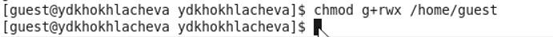

---
## Front matter
lang: ru-RU
title: Лабораторная работа #3
author:	Хохлачева Яна, НКНбд-01-18

## Formatting
toc: false
slide_level: 2
theme: metropolis
header-includes: 
 - \metroset{progressbar=frametitle,sectionpage=progressbar,numbering=fraction}
 - '\makeatletter'
 - '\beamer@ignorenonframefalse'
 - '\makeatother'
aspectratio: 43
section-titles: true
---

# Дискреционное разграничение прав в Linux. Два пользователя

## Цель работы

 - Получение практических навыков работы в консоли с атрибутами файлов для групп пользователей.

## Выполнение работы

{ width=70% }

## Выполнение работы

{ width=70% }

## Выполнение работы

\centering
{ width=40% }
{ width=70% }

## Выполнение работы

\centering
{ width=70% }
{ width=70% }

## Выполнение работы

\centering
{ width=40% }
{ width=70% }
{ width=70% }
{ width=70% }

## Выполнение работы

\centering
{ width=40% }
{ width=70% }
{ width=70% }
{ width=70% }

## Выполнение работы

\centering
{ width=40% }
{ width=70% }
{ width=70% }
{ width=70% }

# Вывод 
 
 - Получила практические навыки работы в консоли с атрибутами файлов для групп пользователей.
