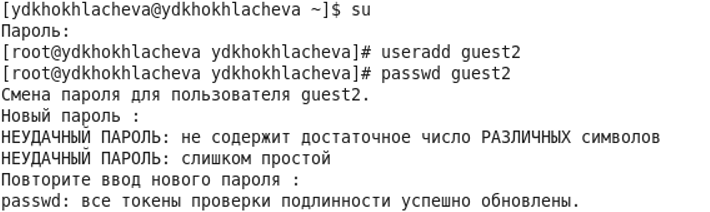
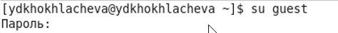
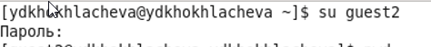
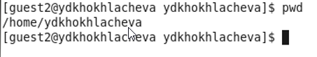
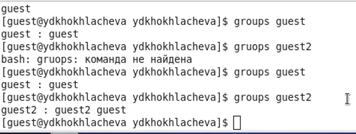
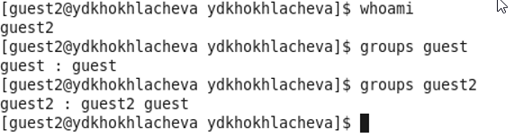
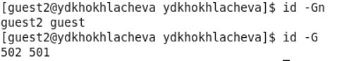
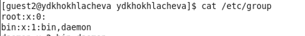
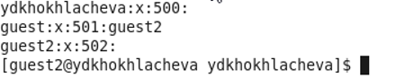

---
# Front matter
lang: ru-RU
title: "Лабораторная работа 3"
subtitle: "Дискреционное разграничение прав в Linux. Два пользователя"
author: "Хохлачева Яна, учебная группа: НКНбд-01-18"

# Formatting
toc-title: "Содержание"
toc: true # Table of contents
toc_depth: 2
lof: true # List of figures
fontsize: 12pt
linestretch: 1.5
papersize: a4paper
documentclass: scrreprt
polyglossia-lang: russian
polyglossia-otherlangs: english
mainfont: Times New Roman
romanfont: Times New Roman
sansfont: Times New Roman
monofont: Times New Roman
mainfontoptions: Ligatures=TeX
romanfontoptions: Ligatures=TeX
sansfontoptions: Ligatures=TeX,Scale=MatchLowercase
monofontoptions: Scale=MatchLowercase
indent: true
pdf-engine: lualatex
header-includes:
  - \linepenalty=10 # the penalty added to the badness of each line within a paragraph (no associated penalty node) Increasing the value makes tex try to have fewer lines in the paragraph.
  - \interlinepenalty=0 # value of the penalty (node) added after each line of a paragraph.
  - \hyphenpenalty=50 # the penalty for line breaking at an automatically inserted hyphen
  - \exhyphenpenalty=50 # the penalty for line breaking at an explicit hyphen
  - \binoppenalty=700 # the penalty for breaking a line at a binary operator
  - \relpenalty=500 # the penalty for breaking a line at a relation
  - \clubpenalty=150 # extra penalty for breaking after first line of a paragraph
  - \widowpenalty=150 # extra penalty for breaking before last line of a paragraph
  - \displaywidowpenalty=50 # extra penalty for breaking before last line before a display math
  - \brokenpenalty=100 # extra penalty for page breaking after a hyphenated line
  - \predisplaypenalty=10000 # penalty for breaking before a display
  - \postdisplaypenalty=0 # penalty for breaking after a display
  - \floatingpenalty = 20000 # penalty for splitting an insertion (can only be split footnote in standard LaTeX)
  - \raggedbottom # or \flushbottom
  - \usepackage{float} # keep figures where there are in the text
  - \floatplacement{figure}{H} # keep figures where there are in the text
---

# Цель работы

Получение практических навыков работы в консоли с атрибутами файлов для групп пользователей.

# Выполнение лабораторной работы

 - В установленной операционной системе создала учётную запись пользователя guest2 (использовала учётную запись администратора): useradd guest2 и задала пароль командой passwd guest
 
{ #fig:001 width=70% }

 - Добавила пользователя guest2 в группу guest: gpasswd -a guest2 guest

{ #fig:003 width=70% }

 - Осуществила вход в систему от двух пользователей на двух разных консолях

{ #fig:004 width=70% }

{ #fig:004 width=70% }

 - Для обоих пользователей командой pwd определила директорию. Сравнила её с приглашениями командной строки.

{ #fig:005 width=70% }

{ #fig:005 width=70% }

 - Уточнила имя вашего пользователя, его группу, кто входит в неё и к каким группам принадлежит он сам. Определила командами groups guest и groups guest2, в какие группы входят пользователи guest и guest2. Сравнила вывод команды groups с выводом команд id -Gn и id -G.

{ #fig:005 width=70% }

{ #fig:005 width=70% }

{ #fig:005 width=70% }

{ #fig:005 width=70% }

 - Сравнила полученную информацию с содержимым файла /etc/group. Просмотрела файл командой cat /etc/group
 
{ #fig:005 width=70% }

{ #fig:005 width=70% }

{ #fig:005 width=70% }

{ #fig:005 width=70% }
 
 - От имени пользователя guest2 выполнила регистрацию пользователя guest2 в группе guest командой newgrp guest
 
{ #fig:005 width=70% }
 
 - От имени пользователя guest изменила права директории /home/guest, разрешив все действия для пользователей группы: chmod g+rwx /home/guest
 
{ #fig:005 width=70% }
 
 - От имени пользователя guest сняла с директории /home/guest/dir1 все атрибуты командой chmod 000 dirl

{ #fig:005 width=70% }
 
# Таблицы

## Таблица 2.1

|Права дир.|Права файла|Созд файла|Удаление файла|Запись в файл|Чтение файла|Смена дир|Просм файлов в дир|Переим файла|Смена атр файла|
|----------|-----------|----------|--------------|-------------|------------|---------|------------------|------------|---------------|
|000       |000        |-         |-             |-            |-           |-        |-                 |-           |-              |
|000       |010        |-         |-             |-            |-           |-        |-                 |-           |-              |
|000       |020        |-         |-             |-            |-           |-        |-                 |-           |-              |
|000       |030        |-         |-             |-            |-           |-        |-                 |-           |-              |
|000       |040        |-         |-             |-            |-           |-        |-                 |-           |-              |
|000       |050        |-         |-             |-            |-           |-        |-                 |-           |-              |
|000       |060        |-         |-             |-            |-           |-        |-                 |-           |-              |
|000       |070        |-         |-             |-            |-           |-        |-                 |-           |-              |
|010       |000        |-         |-             |-            |-           |+        |-                 |-           |-              |
|010       |010        |-         |-             |-            |-           |+        |-                 |-           |-              |
|010       |020        |-         |-             |+            |-           |+        |-                 |-           |-              |
|010       |030        |-         |-             |+            |-           |+        |-                 |-           |-              |
|010       |040        |-         |-             |-            |+           |+        |-                 |-           |-              |
|010       |050        |-         |-             |-            |+           |+        |-                 |-           |-              |
|010       |060        |-         |-             |+            |+           |+        |-                 |-           |-              |
|010       |070        |-         |-             |+            |+           |+        |-                 |-           |-              |
|020       |000        |-         |-             |-            |-           |-        |-                 |-           |-              |
|020       |010        |-         |-             |-            |-           |-        |-                 |-           |-              |
|020       |020        |-         |-             |-            |-           |-        |-                 |-           |-              |
|020       |030        |-         |-             |-            |-           |-        |-                 |-           |-              |
|020       |040        |-         |-             |-            |-           |-        |-                 |-           |-              |
|020       |050        |-         |-             |-            |-           |-        |-                 |-           |-              |
|020       |060        |-         |-             |-            |-           |-        |-                 |-           |-              |
|020       |070        |-         |-             |-            |-           |-        |-                 |-           |-              |
|030       |000        |+         |+             |-            |-           |+        |-                 |+           |-              |
|030       |010        |+         |+             |-            |-           |+        |-                 |+           |-              |
|030       |020        |+         |+             |+            |-           |+        |-                 |+           |-              |
|030       |030        |+         |+             |+            |-           |+        |-                 |+           |-              |
|030       |040        |+         |+             |-            |+           |+        |-                 |+           |-              |
|030       |050        |+         |+             |-            |+           |+        |-                 |+           |-              |
|030       |060        |+         |+             |+            |+           |+        |-                 |+           |-              |
|030       |070        |+         |+             |+            |+           |+        |-                 |+           |-              |
|040       |000        |-         |-             |-            |-           |-        |-                 |-           |-              |
|040       |010        |-         |-             |-            |-           |-        |-                 |-           |-              |
|040       |020        |-         |-             |-            |-           |-        |-                 |-           |-              |
|040       |030        |-         |-             |-            |-           |-        |-                 |-           |-              |
|040       |040        |-         |-             |-            |-           |-        |-                 |-           |-              |
|040       |050        |-         |-             |-            |-           |-        |-                 |-           |-              |
|040       |060        |-         |-             |-            |-           |-        |-                 |-           |-              |
|040       |070        |-         |-             |-            |-           |-        |-                 |-           |-              |
|050       |000        |-         |-             |-            |-           |+        |+                 |-           |-              |
|050       |010        |-         |-             |-            |-           |+        |+                 |-           |-              |
|050       |020        |-         |-             |+            |-           |+        |+                 |-           |-              |
|050       |030        |-         |-             |+            |-           |+        |+                 |-           |-              |
|050       |040        |-         |-             |-            |+           |+        |+                 |-           |-              |
|050       |050        |-         |-             |-            |+           |+        |+                 |-           |-              |
|050       |060        |-         |-             |+            |+           |+        |+                 |-           |-              |
|050       |070        |-         |-             |+            |+           |+        |+                 |-           |-              |
|060       |000        |-         |-             |-            |-           |-        |+                 |-           |-              |
|060       |010        |-         |-             |-            |-           |-        |+                 |-           |-              |
|060       |020        |-         |-             |-            |-           |-        |+                 |-           |-              |
|060       |030        |-         |-             |-            |-           |-        |+                 |-           |-              |
|060       |040        |-         |-             |-            |-           |-        |+                 |-           |-              |
|060       |050        |-         |-             |-            |-           |-        |+                 |-           |-              |
|060       |060        |-         |-             |-            |-           |-        |+                 |-           |-              |
|060       |070        |-         |-             |-            |-           |-        |+                 |-           |-              |
|070       |000        |+         |+             |-            |-           |+        |+                 |+           |-              |
|070       |010        |+         |+             |-            |-           |+        |+                 |+           |-              |
|070       |020        |+         |+             |+            |-           |+        |+                 |+           |-              |
|070       |030        |+         |+             |+            |-           |+        |+                 |+           |-              |
|070       |040        |+         |+             |-            |+           |+        |+                 |+           |-              |
|070       |050        |+         |+             |-            |+           |+        |+                 |+           |-              |
|070       |060        |+         |+             |+            |+           |+        |+                 |+           |-              |
|070       |070        |+         |+             |+            |+           |+        |+                 |+           |-              |

## Таблица 2.2

|Операция|Мин права на директ|Мин права на файл|
|--------|-------------------|-----------------|
|созд файла|- wx               |- - -            |
|удал файла|- wx               |- - -            |
|чтение файла|- - x              |r - -            |
|переим файла|- wx               |- - -            |
|созд поддирект|- wx               |- - -            |
|удал поддирект|- wx               |- - -            |

# Вывод 
 
  - Получила практические навыки работы в консоли с атрибутами файлов для групп пользователей.
