---
## Front matter
lang: ru-RU
title: Лабораторная работа #5
author:	Хохлачева Яна

## Formatting
toc: false
slide_level: 2
theme: metropolis
header-includes: 
 - \metroset{progressbar=frametitle,sectionpage=progressbar,numbering=fraction}
 - '\makeatletter'
 - '\beamer@ignorenonframefalse'
 - '\makeatother'
aspectratio: 43
section-titles: true
---

# Дискреционное разграничение прав в Linux. Исследование влияния дополнительных атрибутов

## Цель работы

 - Изучение механизмов изменения идентификаторов, применения SetUID- и Sticky-битов. Получение практических навыков работы в консоли с дополнительными атрибутами. Рассмотрение работы механизма смены идентификатора процессов пользователей, а также влияние бита Sticky на запись и удаление файлов.

## Выполнение работы

\centering
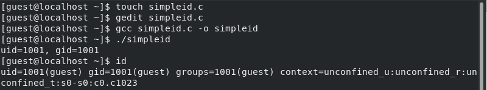{ width=70% }
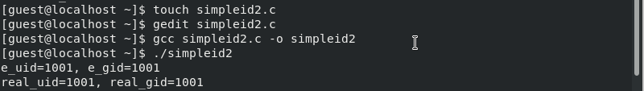{ width=70% }
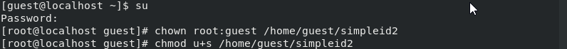{ width=70% }
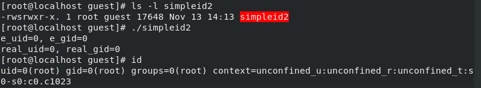{ width=70% }

## Выполнение работы

\centering
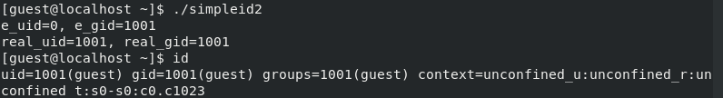{ width=70% }
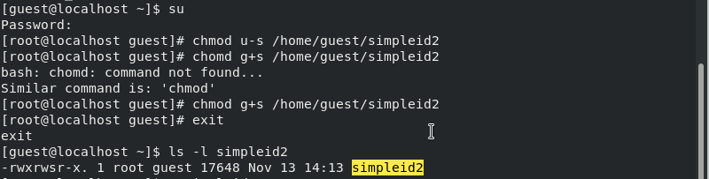{ width=70% }
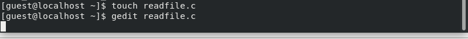{ width=70% }
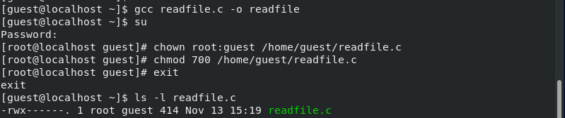{ width=70% }

## Выполнение работы

\centering
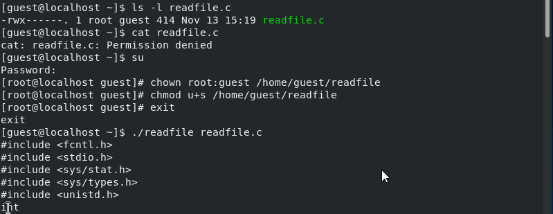{ width=70% }
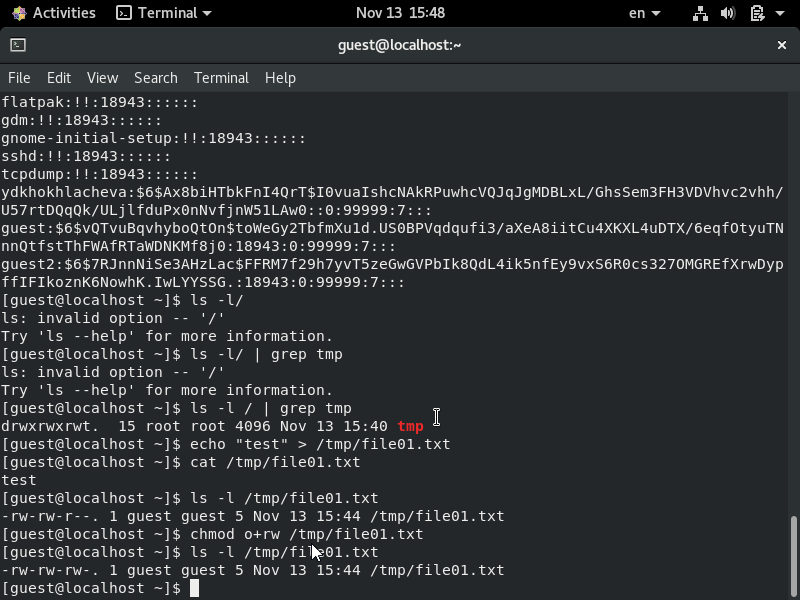{ width=70% }
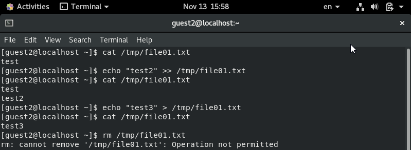{ width=70% }
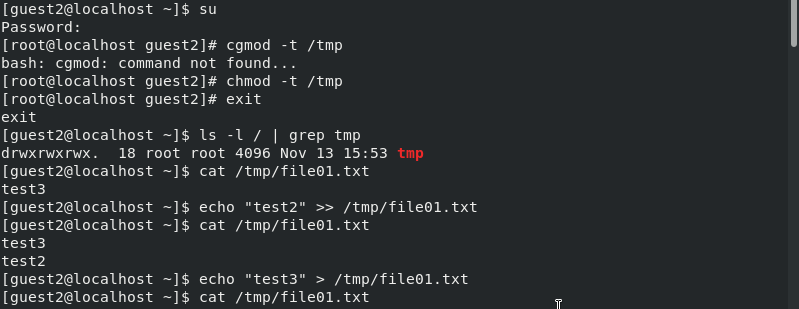{ width=70% }

## Выполнение работы

\centering
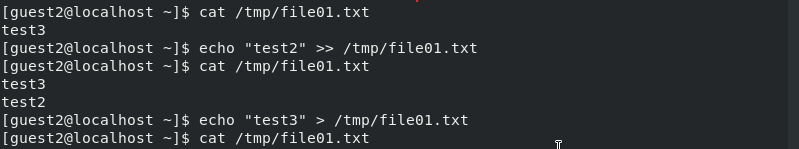{ width=70% }
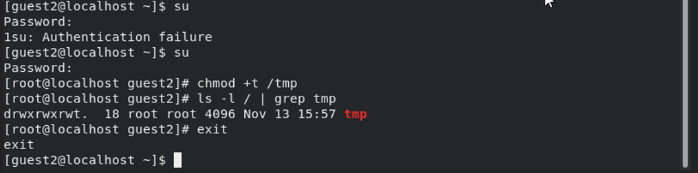{ width=70% }

# Вывод 
 
 - Изучила механизмы изменения идентификаторов, применения SetUID- и Sticky-битов. Получила практические навыков работы в консоли с дополнительными атрибутами. Рассмотрела работу механизма смены идентификатора процессов пользователей, а также влияние бита Sticky на запись и удаление файлов.