---
# Front matter
lang: ru-RU
title: "Информационная безопасность. Лабораторная работа #5."
subtitle: "Дискреционное разграничение прав в Linux. Исследование влияния дополнительных атрибутов"
author: "Хохлачева Яна, учебная группа: НКНбд-01-18"

# Formatting
toc-title: "Содержание"
toc: true # Table of contents
toc_depth: 2
lof: true # List of figures
fontsize: 12pt
linestretch: 1.5
papersize: a4paper
documentclass: scrreprt
polyglossia-lang: russian
polyglossia-otherlangs: english
mainfont: Times New Roman
romanfont: Times New Roman
sansfont: Times New Roman
monofont: Times New Roman
mainfontoptions: Ligatures=TeX
romanfontoptions: Ligatures=TeX
sansfontoptions: Ligatures=TeX,Scale=MatchLowercase
monofontoptions: Scale=MatchLowercase
indent: true
pdf-engine: lualatex
header-includes:
  - \linepenalty=10 # the penalty added to the badness of each line within a paragraph (no associated penalty node) Increasing the value makes tex try to have fewer lines in the paragraph.
  - \interlinepenalty=0 # value of the penalty (node) added after each line of a paragraph.
  - \hyphenpenalty=50 # the penalty for line breaking at an automatically inserted hyphen
  - \exhyphenpenalty=50 # the penalty for line breaking at an explicit hyphen
  - \binoppenalty=700 # the penalty for breaking a line at a binary operator
  - \relpenalty=500 # the penalty for breaking a line at a relation
  - \clubpenalty=150 # extra penalty for breaking after first line of a paragraph
  - \widowpenalty=150 # extra penalty for breaking before last line of a paragraph
  - \displaywidowpenalty=50 # extra penalty for breaking before last line before a display math
  - \brokenpenalty=100 # extra penalty for page breaking after a hyphenated line
  - \predisplaypenalty=10000 # penalty for breaking before a display
  - \postdisplaypenalty=0 # penalty for breaking after a display
  - \floatingpenalty = 20000 # penalty for splitting an insertion (can only be split footnote in standard LaTeX)
  - \raggedbottom # or \flushbottom
  - \usepackage{float} # keep figures where there are in the text
  - \floatplacement{figure}{H} # keep figures where there are in the text
---

## Цель работы

 - Изучение механизмов изменения идентификаторов, применения SetUID- и Sticky-битов. Получение практических навыков работы в консоли с дополнительными атрибутами. Рассмотрение работы механизма смены идентификатора процессов пользователей, а также влияние бита Sticky на запись и удаление файлов.


# Создание программы

1. Подготовила стенд лабораторной в соответствии с указаниями, а в частности: 

 - Проверила наличие компилятора **GCC** командой: **gcc -v**

 - Отключила систему запретов до очередной перезагрузки системы командой **setenforce 0** и проверила вывод комады **getenforce**
 
 - Ознакомилась с информацией о компиляции программ при помощи **GCC**.

2. Вошла в систему от имени пользователя **guest**.


3. Создала программу **simpleid.c** со следущим содержанием:

```C
#include <sys/types.h>
#include <unistd.h>
#include <stdio.h>
int
main ()
{
uid_t uid = geteuid ();
gid_t gid = getegid ();
printf ("uid=%d, gid=%d\n", uid, gid);
return 0;
}
```

4. Скомплилировала программу при помощи команды **gcc simpleid.c -o simpleid** и убедилась, что файл программы создан.

5. Выполнила программу **simpleid** командой **./simpleid**.

6. Выполнила системную команду **id**, результаты выполнения программы и команды - идентичные. 

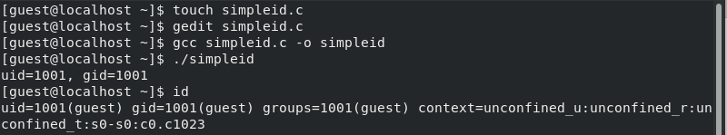{ #fig:003 width=100% }

7. Усложнила программу, добавив вывод действительных идентификаторов, назвала ее **simpleid2.c**:

```C
#include <sys/types.h>
#include <unistd.h>
#include <stdio.h>
int
main ()
{
uid_t real_uid = getuid ();
uid_t e_uid = geteuid ();
gid_t real_gid = getgid ();
gid_t e_gid = getegid () ;
printf ("e_uid=%d, e_gid=%d\n", e_uid, e_gid);
printf ("real_uid=%d, real_gid=%d\n", real_uid, real_gid);
return 0;
}
```

8. Скомпилировала и запустила **simpleid2.c** командами: **gcc simpleid2.c -o simpleid2**, ** ./simpleid2**.

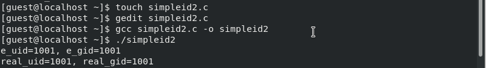{ #fig:004 width=100% }

9. От имени суперпользователя выполнила команды: **chown root:guest /simpleid2**, ** chmod u+s /simpleid2** . 

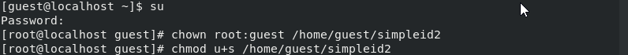{ #fig:005 width=100% }

10. Выполнила проверку правильности установки новых атрибутов и смены
владельца файла **simpleid2** командой: **ls -l simpleid2**

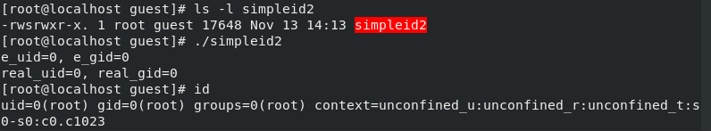{ #fig:006 width=100% }

11. Запустила **simpleid2** и **id**.

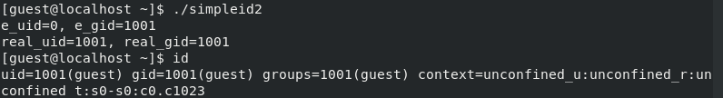{ #fig:006 width=100% }

Результаты отличаются

12. Проделала тоже самое относительно SetGID-бита.

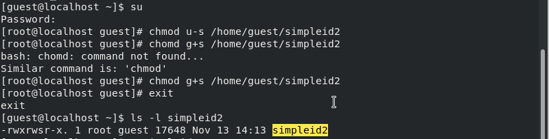{ #fig:001 width=100% }

13. Создала программу **readfile.c**:

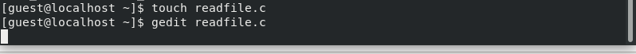{ #fig:001 width=100% }

```C
#include <fcntl.h>
#include <stdio.h>
#include <sys/stat.h>
#include <sys/types.h>
#include <unistd.h>
int
main (int argc, char* argv[])
{
unsigned char buffer[16];
size_t bytes_read;
int i;
int fd = open (argv[1], O_RDONLY);
do
{
bytes_read = read (fd, buffer, sizeof (buffer));
for (i =0; i < bytes_read; ++i) printf("%c", buffer[i]);
}
while (bytes_read == sizeof (buffer));
close (fd);
return 0;
}
```

14. Откомпилировала её командой **gcc readfile.c -o readfile** и сменила владельца у файла **readfile.c** и изменила права так, чтобы только суперпользователь(root) мог прочитать его, a guest не мог, также проверила, что пользователь guest не может прочитать файл **readfile.c**.

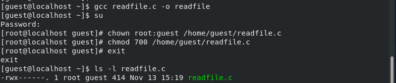{ #fig:001 width=100% }

15. Сменила у программы **readfile** владельца и установила SetU’D-бит.Проверила, может ли программа **readfile** прочитать файл **readfile.с**. Проверила, что программа **readfile** прочитать файл **/etc/shadow**.

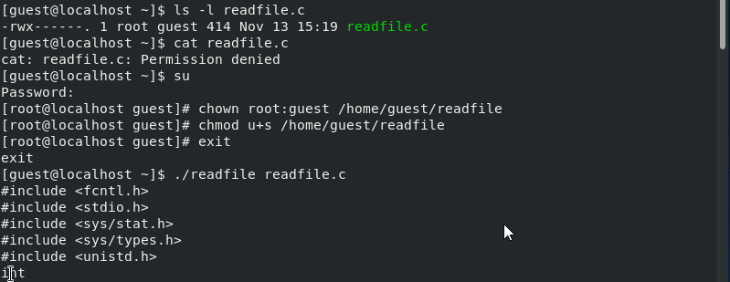{ #fig:001 width=100% }


# Исследование Sticky-бита

1. Выяснила, установлен ли атрибут Sticky на директории **/tmp**, для чего
выполнил команду:  **ls -l / | grep tmp**.От имени пользователя guest создала файл **file01.txt** в директории **/tmp** со словом test командой: **echo "test" > /tmp/file01.txt**. Просмотрела атрибуты у только что созданного файла и разрешил чтение и запись для категории пользователей «все остальные» командами:

**ls -l /tmp/file01.txt**,
**chmod o+rw /tmp/file01.txt**,
**ls -l /tmp/file01.txt**.


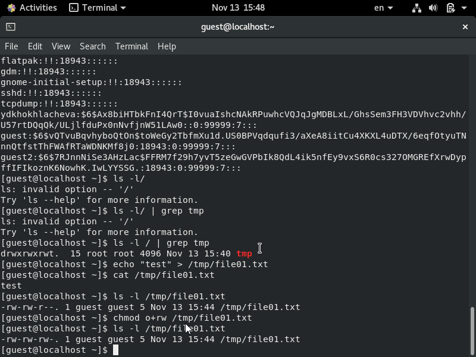{ #fig:001 width=100% }

2. От пользователя guest2 попробовала прочитать файл **/tmp/file01.txt** командой: **cat /tmp/file01.txt**. От пользователя guest2 попробовала дозаписать в файл **/tmp/file01.txt** слово test2 командой **echo "test2" > /tmp/file01.txt**. Удалось ли вам выполнить операцию? (Да).Проверила содержимое файла командой **cat /tmp/file01.txt**. От пользователя guest2 попробовала записать в файл **/tmp/file01.txt**
слово test3, стерев при этом всю имеющуюся в файле информацию командой **echo "test3" > /tmp/file01.txt**.Удалось ли вам выполнить операцию?(Да). Проверила содержимое файла командой **cat /tmp/file01.txt**. От пользователя guest2 попробовал удалить файл **/tmp/file01.txt** командой **rm /tmp/fileOl.txt**.Удалось ли вам удалить файл?(Нет)

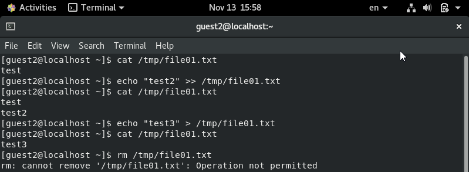{ #fig:001 width=100% }


3. Повысила свои права до суперпользователя следующей командой:  **su -** 
И выполнила после этого команду, снимающую атрибут t (Sticky-бит) с
директории **/tmp**: **chmod -t /tmp**. Покинула режим суперпользователя командой **exit**.

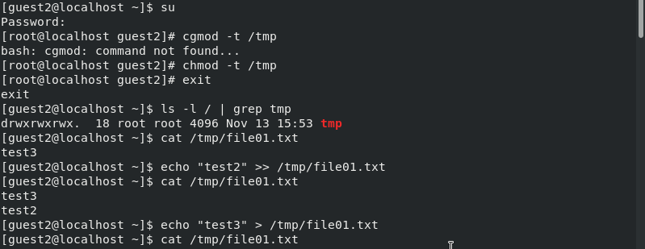{ #fig:001 width=100% }


4. От пользователя guest2 проверил, что атрибута t у директории **/tmp**
нет командой: **ls -l / | grep tmp**.Поверила предыдущие шаги.Удалось удалить файл от имени пользователя, не являющегося его владельцем

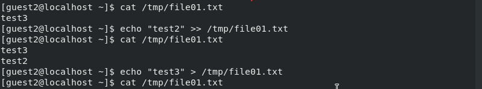{ #fig:001 width=100% }


15. Повысила свои права до суперпользователя и вернула атрибут t на директорию **/tmp**: 
**su -**,
**chmod +t /tmp**,
**exit**.

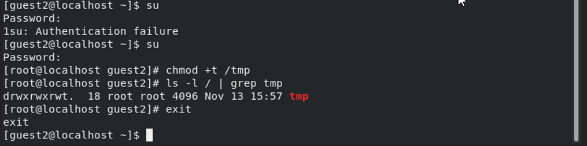{ #fig:001 width=100% }

## Вывод 
 
  - Изучила механизмы изменения идентификаторов, научилас применять SetUID- и Sticky-биты. Получила практические навыки работы в консоли с дополнительными атрибутами. Рассмотрела работу механизма смены идентификатора процессов пользователей, а также влияние бита Sticky на запись и удаление файлов.
