---
## Front matter
lang: ru-RU
title: Лабораторная работа #6
author:	Хохлачева Яна

## Formatting
toc: false
slide_level: 2
theme: metropolis
header-includes: 
 - \metroset{progressbar=frametitle,sectionpage=progressbar,numbering=fraction}
 - '\makeatletter'
 - '\beamer@ignorenonframefalse'
 - '\makeatother'
aspectratio: 43
section-titles: true
---

# Мандатное разграничение прав в Linux

## Цель работы

 - Развить навыки администрирования ОС Linux. Получить первое практическое знакомство с технологией SELinux.
 
 - Проверить работу SELinx на практике совместно с веб-сервером Apache.
 
## Выполнение работы

\centering
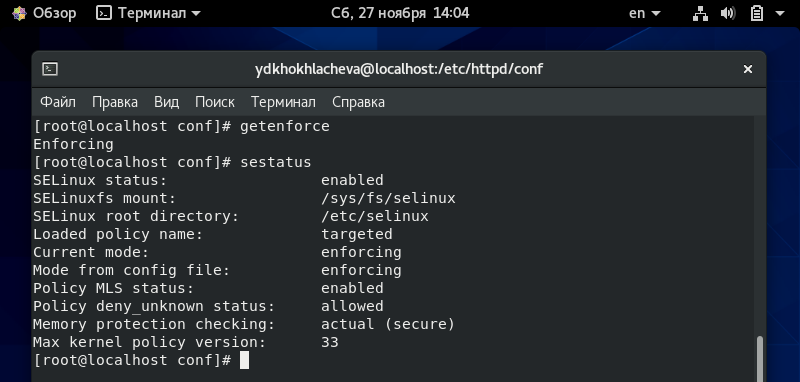{ width=70% }
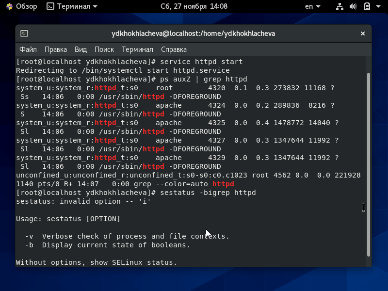{ width=70% }

## Выполнение работы

\centering
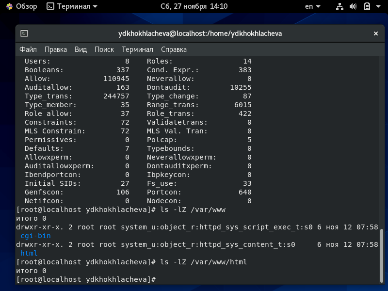{ width=70% }
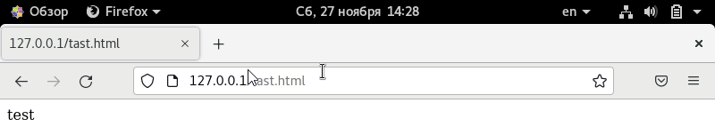{ width=70% }

## Выполнение работы

\centering
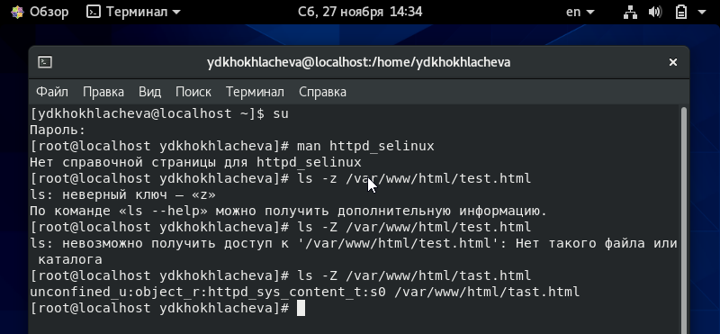{ width=70% }
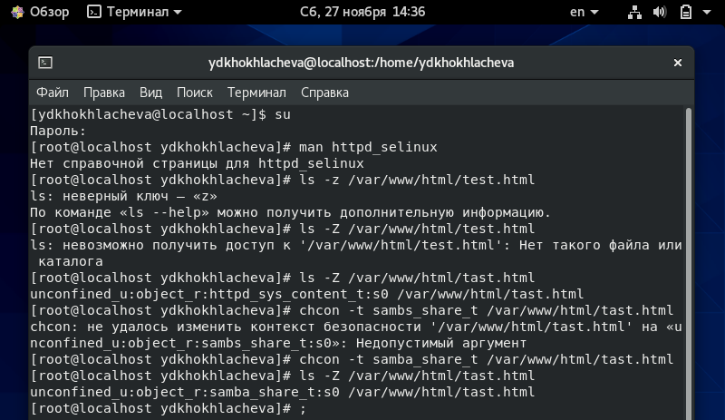{ width=70% }

## Выполнение работы

\centering
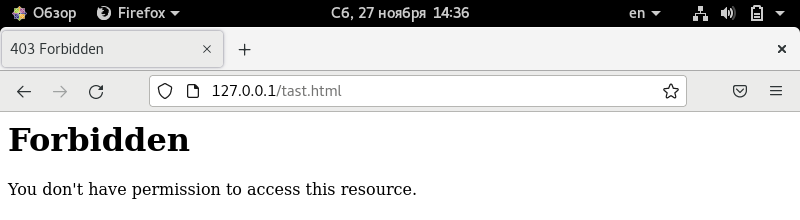{ width=70% }
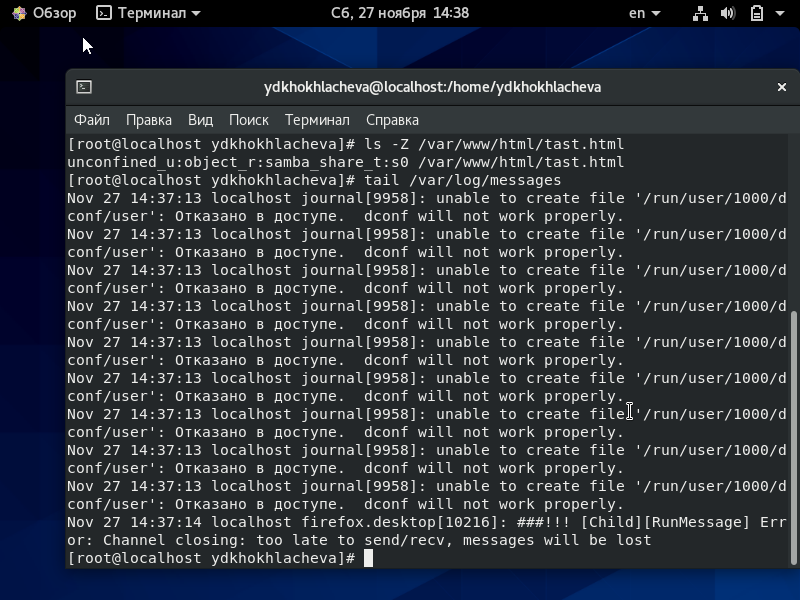{ width=70% }

## Выполнение работы

\centering
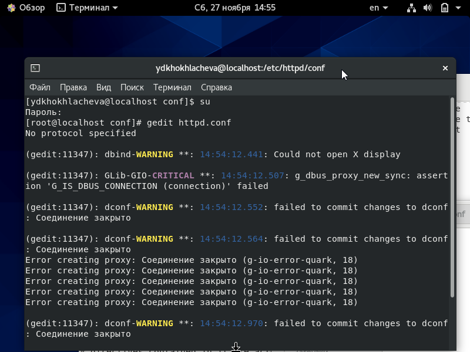{ width=70% }
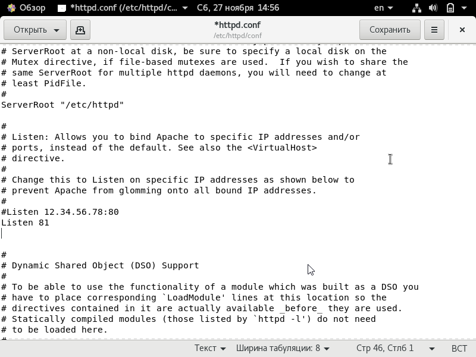{ width=70% }

## Выполнение работы

\centering
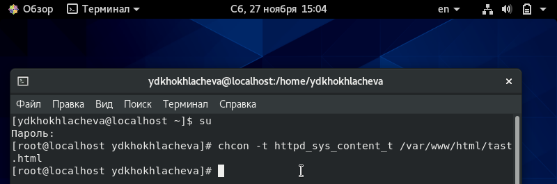{ width=70% }
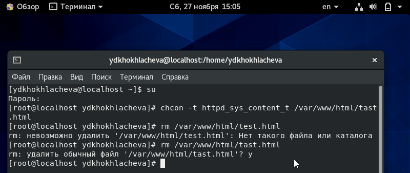{ width=70% }

# Вывод 
 
 - Развила навыки администрирования ОС Linux. Получила первое практическое знакомство с технологией SELinux.
 
 - Проверила работу SELinx на практике совместно с веб-сервером Apache.