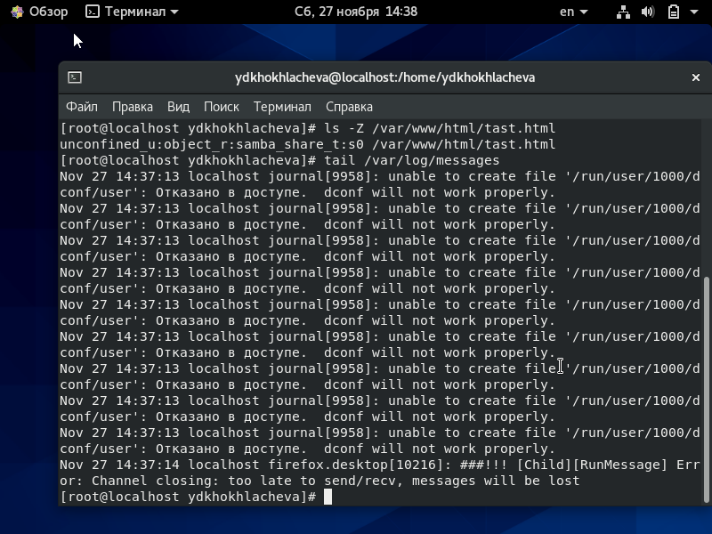
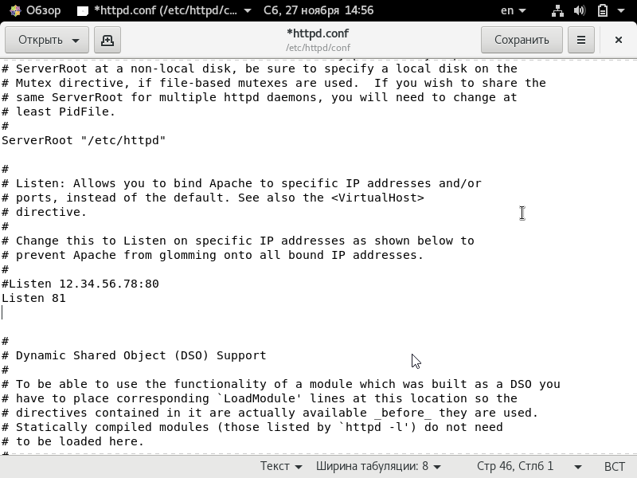

---
# Front matter
lang: ru-RU
title: "Информационная безопасность. Лабораторная работа #6."
subtitle: " Мандатное разграничение прав в Linux"
author: "Хохлачева Яна"

# Formatting
toc-title: "Содержание"
toc: true # Table of contents
toc_depth: 2
lof: true # List of figures
fontsize: 12pt
linestretch: 1.5
papersize: a4paper
documentclass: scrreprt
polyglossia-lang: russian
polyglossia-otherlangs: english
mainfont: Times New Roman
romanfont: Times New Roman
sansfont: Times New Roman
monofont: Times New Roman
mainfontoptions: Ligatures=TeX
romanfontoptions: Ligatures=TeX
sansfontoptions: Ligatures=TeX,Scale=MatchLowercase
monofontoptions: Scale=MatchLowercase
indent: true
pdf-engine: lualatex
header-includes:
  - \linepenalty=10 # the penalty added to the badness of each line within a paragraph (no associated penalty node) Increasing the value makes tex try to have fewer lines in the paragraph.
  - \interlinepenalty=0 # value of the penalty (node) added after each line of a paragraph.
  - \hyphenpenalty=50 # the penalty for line breaking at an automatically inserted hyphen
  - \exhyphenpenalty=50 # the penalty for line breaking at an explicit hyphen
  - \binoppenalty=700 # the penalty for breaking a line at a binary operator
  - \relpenalty=500 # the penalty for breaking a line at a relation
  - \clubpenalty=150 # extra penalty for breaking after first line of a paragraph
  - \widowpenalty=150 # extra penalty for breaking before last line of a paragraph
  - \displaywidowpenalty=50 # extra penalty for breaking before last line before a display math
  - \brokenpenalty=100 # extra penalty for page breaking after a hyphenated line
  - \predisplaypenalty=10000 # penalty for breaking before a display
  - \postdisplaypenalty=0 # penalty for breaking after a display
  - \floatingpenalty = 20000 # penalty for splitting an insertion (can only be split footnote in standard LaTeX)
  - \raggedbottom # or \flushbottom
  - \usepackage{float} # keep figures where there are in the text
  - \floatplacement{figure}{H} # keep figures where there are in the text
---

## Цель работы

 - Развить навыки администрирования ОС Linux. Получить первое практическое знакомство с технологией SELinux.
 
 - Проверить работу SELinx на практике совместно с веб-сервером Apache.


# Создание программы

1. Войдите в систему с полученными учётными данными и убедитесь, что SELinux работает в режиме enforcing политики targeted с помощью команд **getenforce** и **sestatus**.

{ #fig:001 width=100%}

2. Обратитесь с помощью браузера к веб-серверу, запущенному на вашем компьютере, и убедитесь, что последний работает: **service httpd status** или **/etc/rc.d/init.d/httpd status**

Если не работает, запустите его так же, но с параметром **start**.

{ #fig:001 width=100%}

3. Найдите веб-сервер Apache в списке процессов, определите его контекст безопасности и занесите эту информацию в отчёт. Например, можно использовать команду  **ps auxZ | grep httpd**

4. Посмотрите текущее состояние переключателей SELinux для Apache с помощью команды **sestatus -bigrep httpd **

Обратите внимание, что многие из них находятся в положении «off».

5. Посмотрите статистику по политике с помощью команды seinfo, также
определите множество пользователей, ролей, типов.

{ #fig:001 width=100%}

6. Определите тип файлов и поддиректорий, находящихся в директории **/var/www**, с помощью команды **ls -lZ /var/www**

7. Определите тип файлов, находящихся в директории **/var/www/html**: **ls -lZ /var/www/html**

{ #fig:001 width=100%}

8. Определите круг пользователей, которым разрешено создание файлов в директории **/var/www/html**.

9. Создайте от имени суперпользователя (так как в дистрибутиве после установки только ему разрешена запись в директорию) html-файл **/var/www/html/test.html** следующего содержания:

```html
<html>
<body>test</body>
</html>
```

10. Проверьте контекст созданного вами файла. Занесите в отчёт контекст, присваиваемый по умолчанию вновь созданным файлам в директории **/var/www/html**.

11. Обратитесь к файлу через веб-сервер, введя в браузере адрес
** http://127.0.0.1/test.html**. Убедитесь, что файл был успешно отображён.

{ #fig:001 width=100%}

12. Изучите справку **man httpd_selinux** и выясните, какие контексты файлов определены для **httpd**. Сопоставьте их с типом файла
**test.html**. Проверить контекст файла можно командой ** ls -Z /var/www/html/test.html**
Рассмотрим полученный контекст детально. Обратите внимание, что так
как по умолчанию пользователи CentOS являются свободными от типа
(unconfined в переводе с англ. означает свободный), созданному нами
файлу **test.html** был сопоставлен SELinux, пользователь **unconfined_u**.
Это первая часть контекста.
Далее политика ролевого разделения доступа RBAC используется процессами, но не файлами, поэтому роли не имеют никакого значения для
файлов. Роль **object_r** используется по умолчанию для файлов на «постоянных» носителях и на сетевых файловых системах. (В директории
**/ргос** файлы, относящиеся к процессам, могут иметь роль **system_r**.
Если активна политика MLS, то могут использоваться и другие роли,
например, **secadm_r**. Данный случай мы рассматривать не будем, как и
предназначение **:s0**).
Тип **httpd_sys_content_t** позволяет процессу **httpd** получить доступ к файлу. Благодаря наличию последнего типа мы получили доступ к файлу
при обращении к нему через браузер.

{ #fig:001 width=100%}

13. Измените контекст файла **/var/www/html/test.html** с
**httpd_sys_content_t** на любой другой, к которому процесс **httpd** не
должен иметь доступа, например, на **samba_share_t**:
**chcon -t samba_share_t /var/www/html/test.html**
**ls -Z /var/www/html/test.html**

{ #fig:001 width=100%}

14. Попробуйте ещё раз получить доступ к файлу через веб-сервер, введя в
браузере адрес **http://127.0.0.1/test.html**. Вы должны получить
сообщение об ошибке:
**Forbidden You don't have permission to access /test.html on this server.**

{ #fig:001 width=100%}

15. Проанализируйте ситуацию. Почему файл не был отображён, если права
доступа позволяют читать этот файл любому пользователю?
**ls -l /var/www/html/test.html**
Просмотрите log-файлы веб-сервера Apache. Также просмотрите системный лог-файл:
**tail /var/log/messages**
Если в системе окажутся запущенными процессы **setroubleshootd** и
**audtd**, то вы также сможете увидеть ошибки, аналогичные указанным
выше, в файле **/var/log/audit/audit.log**. Проверьте это утверждение самостоятельно.

{ #fig:001 width=100%}

16. Попробуйте запустить веб-сервер Apache на прослушивание ТСР-порта-81 (а не 80, как рекомендует IANA и прописано в **/etc/services**). Для
этого в файле **/etc/httpd/httpd.conf** найдите строчку **Listen 80** и
замените её на **Listen 81**.

{ #fig:001 width=100%}

17. Выполните перезапуск веб-сервера Apache. Произошёл сбой? Поясните
почему?

18. Проанализируйте лог-файлы:
**tail -nl /var/log/messages**
Просмотрите файлы **/var/log/http/error_log**,
**/var/log/http/access_log** и **/var/log/audit/audit.log** и
выясните, в каких файлах появились записи.

19. Выполните команду
**semanage port -a -t http_port_t -р tcp 81**
После этого проверьте список портов командой
**semanage port -l | grep http_port_t**
Убедитесь, что порт 81 появился в списке.

{ #fig:001 width=100%}

20. Попробуйте запустить веб-сервер Apache ещё раз. Поняли ли вы, почему
он сейчас запустился, а в предыдущем случае не смог?

21. Верните контекст **httpd_sys_cоntent__t** к файлу **/var/www/html/ test.html**:
**chcon -t httpd_sys_content_t /var/www/html/test.html**

{ #fig:001 width=100%}

После этого попробуйте получить доступ к файлу через веб-сервер, введя в браузере адрес **http://127.0.0.1:81/test.html**.
Вы должны увидеть содержимое файла — слово «test».

{ #fig:001 width=100%}

22. Исправьте обратно конфигурационный файл apache, вернув **Listen 80**.

23. Удалите привязку **http_port_t к 81** порту:
**semanage port -d -t http_port_t -p tcp 81**
и проверьте, что порт 81 удалён.

24. Удалите файл **/var/www/html/test.html**:
**rm /var/www/html/test.html**

{ #fig:001 width=100%}

## Вывод 
 
 - Развила навыки администрирования ОС Linux. Получила первое практическое знакомство с технологией SELinux.
 
 - Проверила работу SELinx на практике совместно с веб-сервером Apache.
